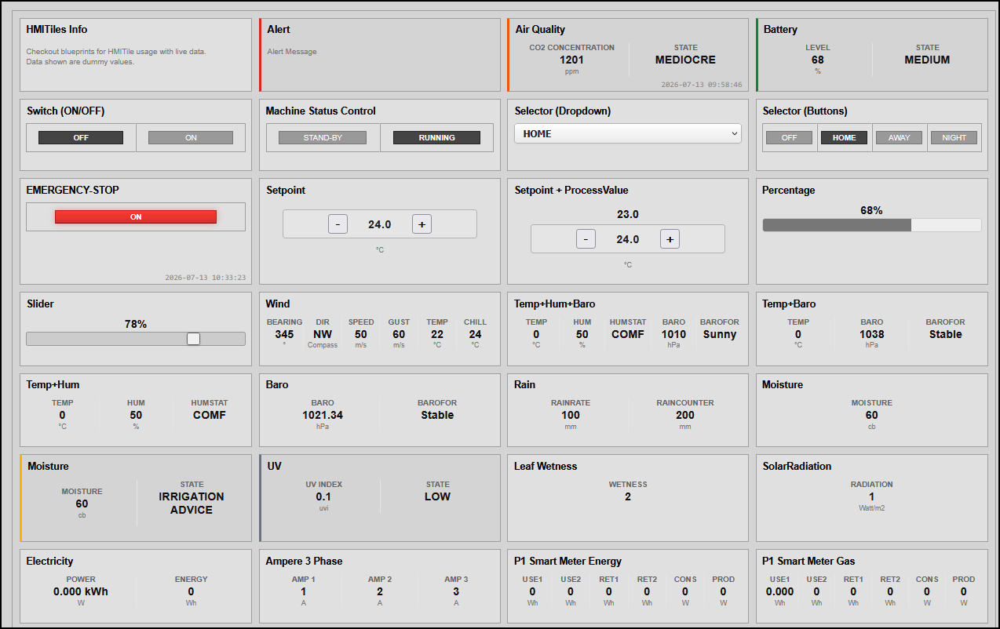
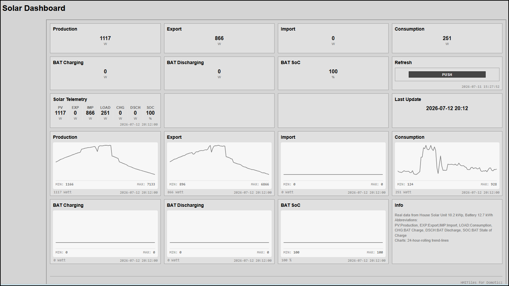
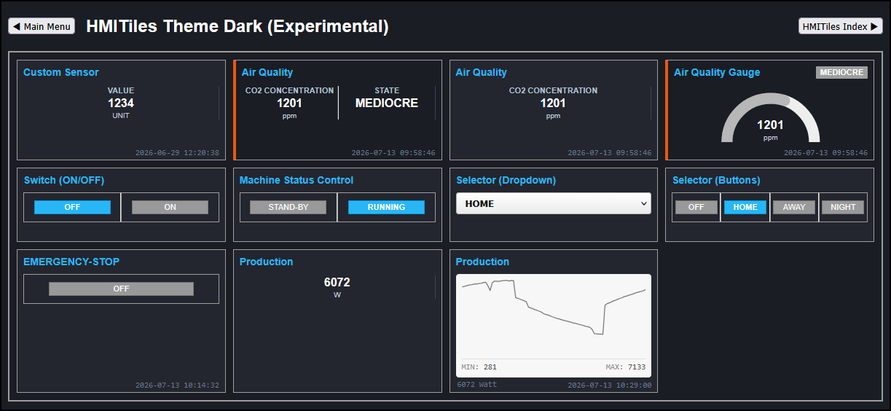

# Changelog

All notable changes to **HMITiles Custom Pages Framework for Domoticz** - are documented in this file.

---

## 20260713 - (2.0.0-BETA)
Major framework rewrite. Work in progress. Pre-release staging phase.

### Summary
Engine completely re-engineered from the ground up to achieve a purely declarative, decoupled architecture.  
This release eliminates inline script blocks from layout files, centralizes event lifecycle boundaries, updates structural typography for high-density industrial environments, and expands HTML-driven template configurations.

### Architectural Breakdown

#### 1. Core JavaScript Engine Overhaul
* **Declarative Routing**: Completely migrated tile rendering logic to an HTML-driven `data-type` property loop. The core loop now automatically initializes layout templates, eliminating the previous tight coupling between raw Domoticz properties and UI element nodes.
* **Global Event Delegation**: Completely isolated interactive event boundaries into an independent control-binding pipeline (`bindControls`). All control gestures (`click`, `change`, `keypress`, `input`) are attached exactly once onto the permanent document root context, ensuring interaction tracks are completely immune to network synchronization redraws.
* **Unified Pre-Parser Layer**: Integrated a centralized hardware utility dictionary to process single-value devices, evaluate array-shifted metrics matrices generically, and automatically handle inconsistent Domoticz casing rules or query variables safely behind the scenes.
* **Natively Integrated Sparklines**: Shifted the historical 24-hour rolling trend engine directly into the core code. Charts are now initialized cleanly via `data-type="chart"`, using a generic object-key extractor to calculate and draw responsive vectors with zero layout overhead.
* **Expanded Core Component Catalog**: Native support fully established for `info`, `value`, `input`, `switch`, `selector`, `dimmer`, `slider`, `progressbar`, `setpoint`, `setpointprocessvalue`, and `chart` card modules.
* **Dynamic Float Precision Guard**: Enhanced the data preparation pipeline with a string-locked floating-point extraction utility (`formatPrecisionValue`) ensuring ultra-high resolution metrics (such as precision `0.0000 kWh` solar accumulation counters) retain trailing decimals without collapsing.

#### 2. Core Stylesheet & Typography Refinements
* **Refactored Box Layouts**: Migrated all old structural container components to the standardized `.hmi-pack-tile` element schema. 
* **Industrial Color Calibration**: Updated background gradients, button fills, and borders to improve compliance with high-performance control deck industry standards.
* **Local Offline Fonts**: Integrated a crisp, high-contrast, squared typography layer using locally-hosted assets. The entire UI is now 100% self-contained and immune to internet outages.

#### 3. Simplified Threshold & Alarm Engine
* **Declarative Threat Matrix**: Wiped out complex conditional checking scripts by introducing two lightweight HTML configuration mappings: `data-state-map` and `data-alarm-direction`. 
* **Universal Severity Evaluator**: Multi-tier alarm state escalations (upward spikes or downward drops, e.g., low battery levels) are handled uniformly inside a single engine tracking pass based on Alert device 5 alarm levels.
* **Multi-Value Multi-Target Indexing**: Upgraded the evaluator to dynamically target distinct data track columns within arrays. The parser now uses leading index digits to isolate checks (e.g., assessing a battery's state of charge directly inside a composite charging payload string).
* **Defensive Edge-Clamping Logic**: Fixed range-boundary logic loops by initializing state values with an explicit boundary fallback ceiling. This halts code lockouts and prevents `CONDITION: 0` glitches when sensor data surpasses maximum threshold parameters.

#### 4. Unified Multi-Column & Single-Value Concept
* **Unified Sizing Framework**: Merged standalone value tiles into a multi-column layout tracking grid matrix, allowing a single card shell to display up to 7 telemetry data columns dynamically.
* **Dynamic Grid Balance**: Introduced automatic spatial cushioning and fallback placeholder properties to prevent visual layout shifts during data ticks.
* **Single-Value Normalization Pipeline**: Enhanced the data-labels attribute loop to process standard single-value devices natively. Defining only a single column layout map converts the payload into a clean, uniform multi-column grid matrix model (`${value};${state}`), treating single data points identically to heavy arrays.
* **Legacy Bypass Fail-Safe**: Integrated a fallback rule where any card omitting advanced attributes completely avoids data modification. Raw Domoticz device logs pass straight to the view layer untouched, preserving 100% backward compatibility for legacy text tiles.

#### 5. Declarative Blueprints Library
* **Zero Script Footprint**: Reworked all isolated blueprint layout templates to match the new v2.0 CSS tokens and `data-type` properties. All layout blueprints are now purely standard HTML text snippets with zero JavaScript code bloat.

**Previews**

(selection only)

---

(real data)

---

(real data)

---

## 20260619 (1.5.0)
#### Added
- **SwitchesPanel** (`blueprints`): Define a panel with N switches (vertical aligned).
- **Alarm** (`blueprints`): Alarm concept with 5 Tier Slots: `critical`, `high`, `medium`, `low`, `info`, and `normal` (for the baseline fallback text).
- **Emergency Stop Button** (`blueprints`): E-Stop (Emergency Stop) using existing Push On Button architecture.
- **HMITiles Workbench** (`blueprints`): Added example number input with min 0.
- **Indicator Matrix** (`blueprints`): High-Performance Grid Indicator 3x3 Matrix.
- **Indoor Air Quality** (`blueprints`): Monitor environmental parameters. 
- **InputTile** (`blueprints`): Added example number input with min 0.
- **Log Monitor** (`blueprints`): Added a scrollable monospace terminal tile to stream server entries. Features low-contrast keyword color-matching compliant with high-performance industry standards, channel selection dropdowns (Status, Detail, Errors), and a native server-side log purge execution pipe.
- **Selector Switch** (`blueprints`): Implemented full-width dropdown control matrices that process and map configurations straight from user-defined local layout tags.
- **Wind** (`blueprints`): Indicates meteorological data values.
- **PicoServoControl** (`examples`): Added LogMonitor tile with filter `[PicoServoControl]` to log commands.
- **Controls Routing Engine** (`core`): Extended the core listener loop to uniformly capture and execute explicit Toggle, Blinds Stop, and momentary Pulse/Push On network transmissions.
- **Controls Routing Engine** (`core`): Injected a global configuration `DEBUG` flag switch to easily gate console diagnostic outputs across browser events.
- **CSS Styles** (`core`): Horizontal rules; Additional classes related to new or updated tiles.
- **Folder examples**: New folder `examples` with SolarInfoPanel, PicoServoControl, PicoTelemetryView. The folder `blueprints` contains HMITile examples (must read for how-to-use).
- **Folder tools**: New folder `hmitilesindex` with high-density dashboard solution designed specifically for **Domoticz** and optimized for **HMITiles**. 

#### Changed
- **Folder blueprints**: Blueprint sub-folders naming without prefix numbering for easier maintenance.
- **HMITiles Workbench** (`blueprints`): Reworked the index simulator template with matched virtual device IDXs and cross-referenced multi-variable datasets to support full offline rendering tests.

---

## 20260604 (1.0.0)
#### Added
- **Initial Public Release**: Official launch of the HMITiles Custom Pages Framework for Domoticz. Published the documentation and architecture announcement thread on the [Domoticz Community Forum](https://domoticz.com).

---

