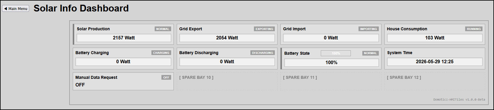
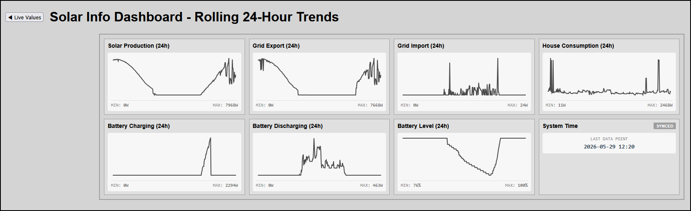
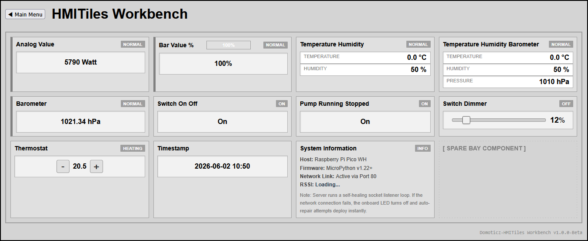
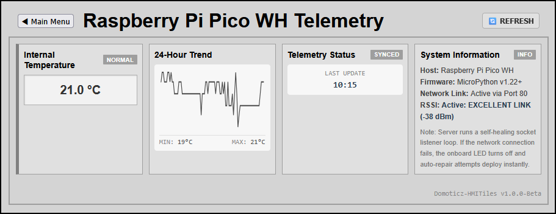

# Domoticz-HMITiles

Tile-based custom pages for Domoticz using HTML/CSS/JS.

An open-source project for experimenting with structured, tile-based dashboards inside Domoticz custom pages. 
It is shared mainly as inspiration for others building their own UI solutions.

---

## Screenshots

**SolarInfo Dashboard example**  



**Workbench (development / testing area)**  


**Raspberry Pi Pico WH Telemetry**  


---

## Overview

Domoticz-HMITiles is a set of reusable HMI-style tiles for Domoticz custom pages.

These tiles can be combined to build structured, tile-based dashboards for visualizing device data.

The project started as a personal experiment based on earlier work with a B4X HMITiles concept.

---

## Key ideas

- Tile-based layout for device visualization
- Simple HMI (Human Machine Interface) style design approach
- Separation between UI logic and Domoticz data handling
- Binding elements via `data-device-idx`
- Minimal visual design with optional alarm highlighting
- Independent custom pages per use case

---

## Example custom pages

- HMITiles workbench for developing and testing tiles
- Solar energy overview (production / house / grid / battery)
- Raspberry Pi Pico servo control (WiFi-based)
- Raspberry Pi Pico telemetry view (WiFi-based)

---

## HMITiles Workbench

The `workbench/` folder is used for experimenting and developing new tile layouts.

It allows:
- testing UI layouts
- prototyping new tile components
- validating data binding approaches

---

## QUICK_START

The folder `docs`contains severs `QUICK_START.md` guides explains how to build basic custom pages using this structure.

It covers:
- folder structure
- basic tile(s) setup
- connecting Domoticz device data
- getting trend data

---

## Repository structure

```
Domoticz-HMITiles/
├── LICENSE                          # MIT license
├── docs               			     # Quick start guides to build first custom page
└── www/
    └── templates/
        ├── hmitiles.css             # Global styling for all tiles and layouts
        ├── hmitiles.js              # Shared UI logic (device binding, DOM helpers)
        ├── SolarInfoDashboard.html  # Domoticz custom page wrapper (solar example)
        ├── ServoControl.html        # Domoticz custom page wrapper (servo control)
        ├── PicoTelemetry.html       # Domoticz custom page wrapper (ESP/Pico data)
        ├── HMITilesWorkbench.html   # Entry page for tile development workbench

        ├── hmitilesworkbench/   # Isolated tile development environment
        │   ├── index.html       # Workbench main test layout
        │   └── hmitiles.index   # Local test configuration / data stub

        ├── solarinfodashboard/  # Solar energy dashboard module
        │   ├── index.html       # Main solar UI layout
        │   └── trends.html      # Historical trend visualization view

        ├── servocontrol/        # Servo control dashboard module
        │   └── index.html       # Slider/button control interface

        └── picotelemetry/       # Microcontroller telemetry dashboard
            └── index.html       # Live sensor and system status view```
```
---

## Notes

This is an experimental hobby project and may evolve over time. It is not a finished product.

Feedback, ideas, and suggestions are welcome.

---

## License

MIT License