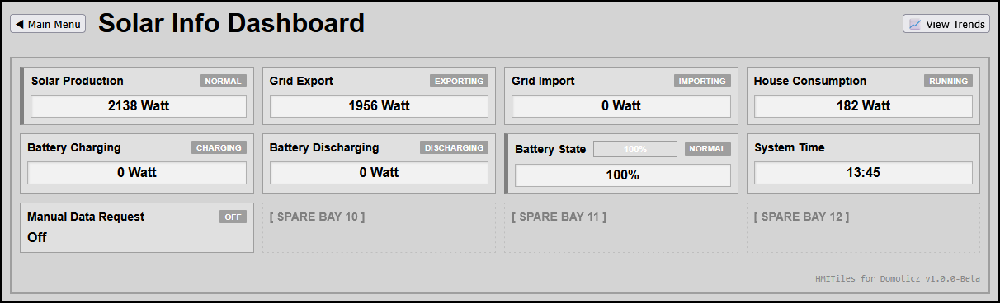
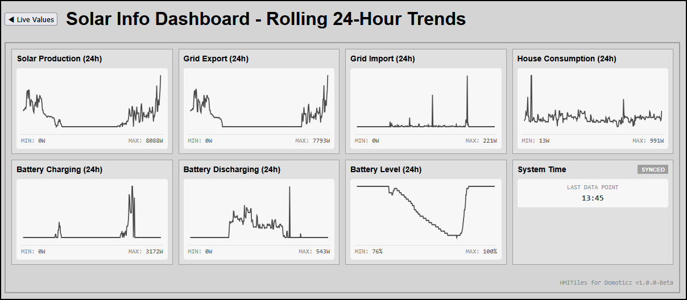
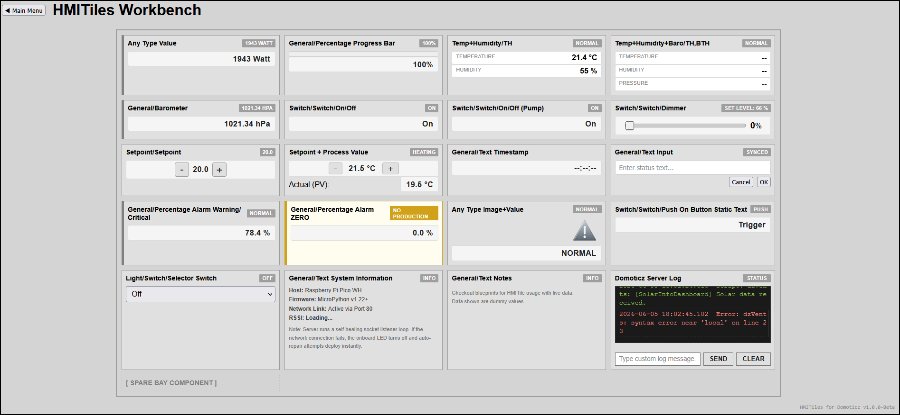
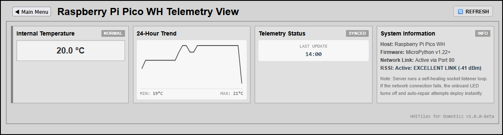

# HMITiles-for-Domoticz

Tile-based custom pages for Domoticz using HTML, CSS, and vanilla JavaScript.

An open-source framework for building structured, high-density, tile-based dashboards inside Domoticz custom page environments. It is shared primarily as an architectural blueprint and inspiration for others seeking to engineer custom smart home user interfaces.

This framework brings High-Performance Human Machine Interface (HMI) design principles to the smart home environment, focusing on clean, consistent, and highly disciplined user interfaces. The core focus of this architecture is clarity, situational awareness, and operational efficiency—not visual special effects or decorative UI clutter.

---

## Screenshots

**Solar Info Dashboard Example**  



**Workbench (Development / Testing Area)**  


**Raspberry Pi Pico WH Telemetry View**  


---

## Overview

**HMITiles-for-Domoticz** provides a collection of reusable, industrial-inspired modular components for Domoticz custom layouts. 
These tiles combine seamlessly into responsive grid matrices to monitor complex home telemetry data points. 

The framework started as a personal open-source project, evolving from earlier layout prototypes developed under a [B4X HMITiles](http://www.b4x.com/android/forum/threads/hmitiles.169774/) design concept.

---

## Core Features & Design Principles

* **High-Performance HMI Rules**: Following widely accepted industrial HMI principles. Elements maintain muted gray or dark charcoal baselines during steady-state runtime. Saturated, desaturated warning highlights are reserved strictly for active alarm thresholds (`data-warn-low`, `data-crit-high`) to reduce operator eye strain and draw attention efficiently.
* **Decoupled Architecture**: Keeps visual presentation layout properties completely isolated from backend server data fetches. 
* **Declarative DOM Injection**: Zero-config device mapping. Domoticz hardware registers bind instantly to the user interface using clean HTML `data-device-idx` attributes.
* **Ecosystem Extension Hooks**: Leverages a central `window.onHMITileProcess` callback executing at the top of the processing loop. Custom layouts can intercept, evaluate, and transform incoming data packets (e.g., streaming 24-hour canvas sparkline trend lines, managing text inputs, or running complex multi-variable conditions) without triggering separate polling loops or stalling the server.
* **Generic State Validation**: Automated alarm handlers (`checkAlarmThresholds`) evaluate numeric profiles natively using metadata tags embedded in your HTML layout, removing all hardcoded device indexing from the core code.
* **Independent Page Routing**: Engineered to function as completely standalone, purpose-driven custom pages built for discrete automation monitoring tasks.

---

## Included Page Blueprints

* **`10-hmitiles-workbench`**: An interactive testing layout panel used for mocking up new modular components, validating styles, and debugging device index assignments.
* **`20-create-single-tile-page`**: A basic entry-level walkthrough for establishing file pathways, creating your first tile wrapper, and establishing server handshakes.
* **`50-solar-info-dashboard`**: A dense four-column process view detailing live energy flows across production, household consumption, grid balance, and battery bank state-of-charge.
* **`51-pico-servo-control`**: A clean, WiFi-based microcontroller interface facilitating remote multi-axis servo positioning commands.
* **`52-pico-telemetry-view`**: Real-time diagnostic monitoring tracking internal silicon temperature logs, virtual text data timestamps, and antenna Wi-Fi RSSI signal strength fields.

---

## Directory Manual Mapping

The `blueprints/` folder acts as an interactive repository index. Selecting any blueprint directory on GitHub will automatically render its localized `README.md` containing specific implementation code blocks, connection tutorials, and layout previews:

* **[10] Framework Tile Workbench** -> `blueprints/10-hmitiles-workbench/`
* **[20-49] Step-By-Step Tutorials** -> Guide blueprints for building your first custom tile and standalone pages.
* **[50+] Ready-to-Run Applications** -> Full deployment examples featuring the centralized ecosystem hook architecture.

---

## Repository Structure

```
HMITiles-for-Domoticz/
├── core/                           	# Standard shared framework engines
│   ├── hmitiles.css                	# Global styling for all tiles and layouts
│   └── hmitiles.js                 	# Shared UI logic (bulk polling loop, hook dispatcher)
├── blueprints/                     	# Custom page examples, tutorials, and apps
│   ├── 10-hmitiles-workbench/      	# Tile design test bed folder
│   │   ├── index.html              	# Standalone workbench interface markup
│   │   ├── HMITilesWorkbench.html  	# Domoticz custom page wrapper definition
│   │   ├── README.md               	# Detailed usage instructions
│   │   └── hmitiles-workbench.png  	# Layout preview graphic
│   ├── 20-create-single-tile-page/ 	# Foundational onboarding tutorial
│   │   ├── SingleTilePage.html     	# Domoticz tab navigation file
│   │   ├── singletilepage/         	# Core application directory
│   │   └── index.html              	# Main blueprint page structure
│   └── ...
├── LICENSE                         	# MIT open-source license
└── README.md                       	# Documentation entry point manual
```

---

## Quick Start

Follow these steps to deploy and run the `SingleTilePage` blueprint example directly inside your local Domoticz installation.

1. **Deploy Core Framework**: Copy the files `hmitiles.css` and `hmitiles.js` from the `core/` repository folder into your Domoticz `/www/templates/` directory.
2. **Select the Blueprint**: Navigate into the repository folder `blueprints/20-create-single-tile-page/`.
3. **Deploy Custom Page Wrapper**: Copy the file `SingleTilePage.html` into your Domoticz `/www/templates/` directory.
4. **Deploy Application Subfolder**: Copy the entire subfolder `singletilepage/` into your Domoticz `/www/templates/` directory.
5. **Launch Interface**: Open your Domoticz Web UI -> select the **Custom** tab -> click **SingleTilePage**. The custom dashboard view `Blueprint Single Tile Page` will load immediately.

### Final Domoticz Directory Structure
Your Domoticz `/www/templates/` server folder path must reflect this exact layout:
```
domoticz/www/templates/
├── hmitiles.css            # Framework shared styles
├── hmitiles.js             # Core polling and hook loop engine
├── SingleTilePage.html     # Domoticz tab navigation wrapper file
└── singletilepage/         # Dedicated application folder assets
	└── index.html          # Main HTML structure and page hook scripts
```
---

## Project Status

This is an experimental hobby framework shared as-is for home automation developers and will continue to evolve over time. 
**It is not a commercial, ready-made consumer product.**

Feedback, optimization forks, code suggestions, or interface feature requests are highly welcome!

---

## Credits & Acknowledgments

This framework was made possible thanks to the foundational work of the open-source home automation community and collaborative engineering support:

* **[Domoticz Home Automation](https://domoticz.com)** – For providing a robust, highly resilient, and open-source smart home server environment. Their flexible JSON API and custom web-server template directories serve as the engine core for these custom dashboards.
* **AI Collaboration Support** – For real-time architectural engineering, code optimization, and assistance refactoring the ecosystem hook pattern to comply with strict high-performance HMI concepts.

---

## License

*Developed by **Robert W.B. Linn** — Released under the terms of the [MIT License
