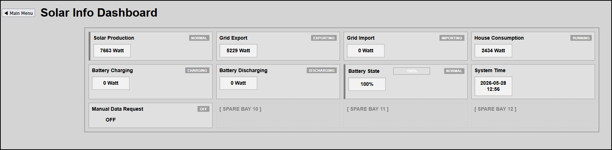

# Domoticz-HMITiles

An open-source HMI (Human Machine Interface) tile layout framework for Domoticz, following widely accepted industrial HMI principles. 

This project aims to bring structured, industry-inspired HMI design principles into the Domoticz ecosystem, bridging **Node-RED** (Modbus data fetching), an optimized **dzVents engine script** (safe data parsing), and a **lightweight HTML5/CSS3/JS user interface**.

> 💡 **Related Project:** This repository is the web-based Domoticz implementation of the original [B4X HMITiles Library](https://github.com), extending its core design philosophy into home automation web ecosystems.

## Features
* **Industry-Inspired Design:** Structured, clean tiles focus heavily on situational awareness and clear data hierarchy.
* **Perfect 4x2 Grid Matrix:** Instant layout mapping across all critical solar infrastructure points.
* **Interactive Logger Integration:** Clicking any active tile element instantly targets and opens the native Domoticz device chart log.
* **Asynchronous Manual Updates:** Trigger real-time, ad-hoc server data polls safely with a looping-protected manual switch layout.
* **Dynamic Industrial Alarms:** Live data-alarm attribute injection handles dynamic boundary colors (Warning/Critical) natively.

---

## Screenshots

 

---

## System Architecture Flow
```text
[Solar Unit Modbus] 
       │
       ▼ (Reads Raw Registers)
   [Node-RED] ─── (Serves CSV via HTTP Endpoint) ───┐
                                                    │
   ┌────────────────────────────────────────────────┘
   ▼
[Domoticz dzVents Script] ─── (Parses CSV & Updates Virtual Devices IDX 5-12)
   │
   ▼ (Serves real-time JSON Data)
[HMITiles Front-End Webpage] ─── (Renders UI, Live Timestamps & Charts)
```

---

## Folder structure

```
Domoticz-HMITiles/
├── LICENSE                 # MIT License file
├── README.md               # The comprehensive setup guide
├── backend/
│   ├── node-red-flow.json  # Exported Node-RED Modbus flow snippet
│   └── SyncSolarMetrics.lua# Backup of your dzVents parsing script
└── www/
    └── templates/
        ├── SolarInfoDashboard.html  	# Custom Domoticz tab page
        └── solarinfodashboard/
            ├── index.html            	# Main layout dashboard file
            ├── hmitiles.css            # Layout stylesheet file
            └── hmitiles.js             # Chart linking script engine
```

--- 

## File Installation Paths

For a standard Domoticz installation, deploy the front-end files into your local web templates directory:

```text
/home/pi/domoticz/www/templates/
├── SolarInfoDashboard.html
└── solarinfodashboard/
    ├── index.html
    ├── hmitiles.css
    └── hmitiles.js
```

### Custom Dashboard Loading

The `SolarInfoDashboard.html` file acts as your main custom tab. Make sure its header links target the assets inside the subfolder correctly:

```html
<!-- Inside SolarInfoDashboard.html -->
<link rel="stylesheet" href="solarinfodashboard/hmitiles.css">
<script src="solarinfodashboard/hmitiles.js" defer></script>
```

---

## Setup Instructions

### 1. Domoticz Device Configurations
Create the following virtual devices using the **Dummy** hardware type in your Domoticz utility panel:


| IDX | Device Name | Type / SubType | Target Metric Field |
| :--- | :--- | :--- | :--- |
| **5** | `PowerFlowSolar` | Usage, Electric | Solar Production (W) |
| **6** | `SolarDataRequest` | Light/Switch (Push On) | Manual Override Button |
| **7** | `PowerFromGrid` | Usage, Electric | Grid Import Power (W) |
| **8** | `PowerToGrid` | Usage, Electric | Grid Export Power (W) |
| **9** | `PowerToHouse` | Usage, Electric | House Consumption (W) |
| **10** | `PowerToBattery` | Usage, Electric | Battery Charging (W) |
| **11** | `PowerFromBattery` | Usage, Electric | Battery Discharging (W) |
| **12** | `BatteryState` | Percentage | State of Charge (%) |

---

### 2. dzVents Backend Setup
1. In Domoticz, navigate to **Setup -> More Options -> Events**.
2. Create a new **dzVents** script, name it `SyncSolarMetrics`, and paste the following optimized script:

```lua
--[[
Event: SyncSolarMetrics
Brief: Periodically polls the local solar endpoint to extract and update device metrics.
Date: 2026-05-28
]]--

local IDX_MANUAL_BUTTON = 6 
local IDX_POWER_FROM_SOLAR = 5
local IDX_POWER_FROM_GRID = 7
local IDX_POWER_TO_GRID = 8
local IDX_POWER_TO_HOUSE = 9
local IDX_POWER_TO_BATTERY = 10
local IDX_POWER_FROM_BATTERY = 11
local IDX_BATTERY_CHARGE_STATE = 12

local URL_SERVER = 'http://homeassistant.local'
local TIMER_INTERVAL = 'every minute'
local HTTP_RESPONSE = 'OnHTTPResponse'

return {
    active = true,
    logging = { level = domoticz.LOG_INFO, marker = '[SolarInfoRequest]' },
    on = {
        timer = { TIMER_INTERVAL },
        devices = { IDX_MANUAL_BUTTON },
        httpResponses = { HTTP_RESPONSE }
    },
    execute = function(domoticz, item)
        if (item.isHTTPResponse) then
            if (item.ok and item.statusCode == 200) then
                local rawData = item.data  
                if not rawData or rawData == "" then return end

                local function parseData(data)
                    local values = {}
                    for token in string.gmatch(data, "[^,]+") do
                        table.insert(values, tonumber(token) or 0)
                    end
                    return values
                end
                local result = parseData(rawData)

                if #result >= 9 then
                    domoticz.devices(IDX_POWER_FROM_SOLAR).updateEnergy(result[1])
                    domoticz.devices(IDX_POWER_FROM_GRID).updateEnergy(result[2])
                    domoticz.devices(IDX_POWER_TO_GRID).updateEnergy(result[3])
                    domoticz.devices(IDX_POWER_TO_HOUSE).updateEnergy(result[4])
                    domoticz.devices(IDX_POWER_TO_BATTERY).updateEnergy(result[5])
                    domoticz.devices(IDX_POWER_FROM_BATTERY).updateEnergy(result[6])
                    domoticz.devices(IDX_BATTERY_CHARGE_STATE).updatePercentage(result[7])
                end
            end
        else
            if (item.isDevice and item.state == 'On') then
                item.switchOff().afterSec(2).silent() -- Silent prevents infinite loops!
            end
            domoticz.openURL({ url = URL_SERVER, method = 'GET', callback = HTTP_RESPONSE })
        end
    end
}
```

---

### 3. Front-End Deploy
1. Clone this repository to your web directory or host it inside your custom Domoticz directory.
2. Open `hmitiles.js` and point the `DOMOTICZ_BASE_URL` to your local running instance:
```javascript
const DOMOTICZ_BASE_URL = "http://YOUR_DOMOTICZ_IP:8080";
```
3. Load up your `index.html` file in any modern web browser to display your plant metrics.

---

## License
This project is licensed under the MIT License - see the LICENSE file for details.

Developed by **Robert W.B. Linn** (c) 2026.
