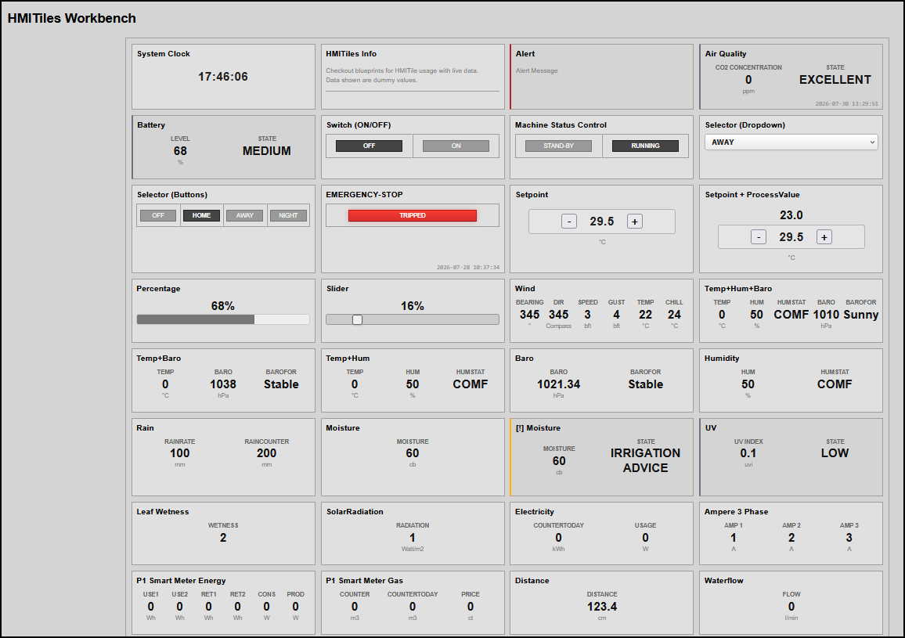
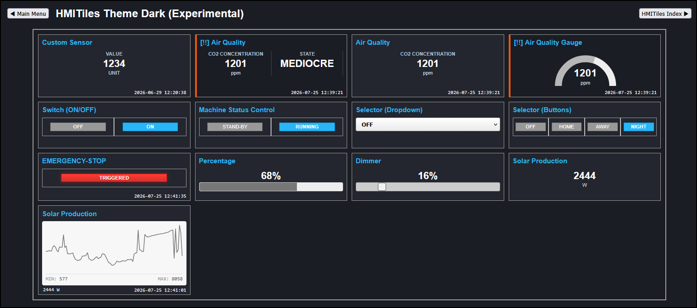
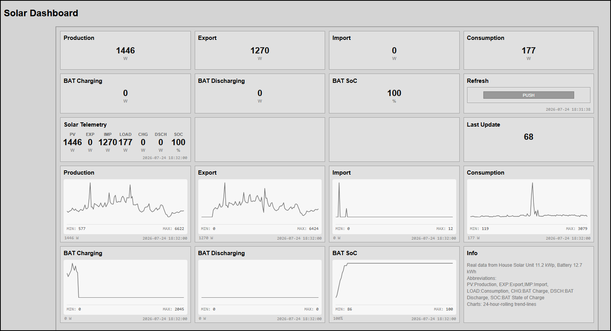

# HMITiles Custom Pages Framework for Domoticz

> [!WARNING]
> **BETA**: **v2.3.0** new `Roomplan` blueprint for automated dashboard generation; new tile to list of devices name & data properties. Check out the latest updates and configuration details in the [CHANGELOG.md](./CHANGELOG.md).

**HMITiles for Domoticz** is a lightweight, independent web dashboard framework designed to monitor and control your smart home using clean, space-saving tiles.

By bringing the efficiency of professional industrial control panels (HMI) to home automation, this project focuses entirely on clarity, speed, and 
instant situational awareness—deliberately avoiding heavy animations, decorative clutter, or useless UI widgets.

## Key Highlights

* High-Density Layouts: Compact, information-rich tile designs that pack critical smart home data onto a single screen.
* Purely Declarative: Build or customize your entire dashboard directly in HTML without writing a single line of JavaScript.
* Automatic Roomplan Pages: Zero-configuration page creation. Generate full control pages instantly straight from your existing Domoticz Roomplans.
* Ultra-Lightweight: Zero heavy dependencies, ensuring instant page loading and blistering performance on wall-mounted tablets, phones, or old browsers.

---

## Blueprints (Selection)

### Workbench (Development / Testing Area) 


### Theme Dark (Experimental)



## Application Example


---

## Overview

**HMITiles-for-Domoticz** provides a collection of clean, industrial-inspired modular components to build custom layouts.  
These tiles combine into flexible grids designed to display complex smart home data at a single glance. 
By separating the user interface design from the backend data synchronization, the framework acts as an adaptable blueprint. 
This allows developers and hobbyists to create high-performance, tailored dashboards with ease.

**Project Origin**  
This framework started as a personal open-source project, evolving from earlier layout prototypes and design concepts originally developed under the B4X HMITiles platform.

---

## Core Features & Design Principles

* **High-Performance HMI Rules**: Follows industrial HMI principles. Elements maintain muted gray or dark charcoal baselines during steady-state runtime. Saturated, desaturated warning highlights are reserved strictly for active alarm thresholds (`data-warn-low`, `data-crit-high`) to reduce operator eye strain and draw attention efficiently.
* **Decoupled Architecture**: Keeps visual presentation layout properties completely isolated from backend server data fetches. 
* **Declarative DOM Injection**: Zero-config device mapping. Domoticz hardware registers bind instantly to the user interface using clean HTML `data-device-idx` attributes.
* **Ecosystem Extension Hooks**: Leverages a central `window.onHMITileProcess` callback executing at the top of the processing loop. Custom layouts can intercept, evaluate, and transform incoming data packets (e.g., streaming 24-hour canvas sparkline trend lines, managing text inputs, or running complex multi-variable conditions) without triggering separate polling loops or stalling the server.
* **Generic State Validation**: Automated alarm handlers (`checkAlarmThresholds`) evaluate numeric profiles natively using metadata tags embedded in your HTML layout, removing all hardcoded device indexing from the core code.
* **Independent Page Routing**: Engineered to function as completely standalone, purpose-driven custom pages built for discrete automation monitoring tasks.

**Design Philosophy**
This framework bypasses typical flashy smart-home trends to strictly mirror modern industrial HMI standards - using muted baselines to reduce eye strain and reserving high-contrast colors exclusively for active process alarms.

---

## Included Custom Page Examples & Blueprints
(Selective)
#### Blueprints
* **`workbench`**: An interactive testing layout panel used for mocking up new modular components, validating styles, and debugging device index assignments.
* **`values`**: A basic entry-level walkthrough for establishing file pathways, creating your first tile wrapper, and establishing server handshakes.
* more...
#### Examples
* **`solardashboard`**: A dense four-column process view detailing live energy flows across production, household consumption, grid balance, and battery bank state-of-charge.
* more...

---

## Directory Manual Mapping

The `blueprints/` folder acts as an interactive repository index. 

Selecting any blueprint directory on GitHub will automatically render its localized `README.md` containing specific implementation code blocks, connection tutorials, and layout previews:

---

## Repository Structure

```
HMITiles-for-Domoticz/
├── core/                           	# Standard shared framework engines
│   ├── hmitiles.css                	# Global styling for all tiles and layouts
│   ├── hmitiles.js                 	# Shared UI logic (bulk polling loop, hook dispatcher)
│   ├── hmitiles-preparser.js           # Pre-parse Domoticz specific devices data into HMITiles standard format used by the processor
│   ├── hmitiles-processor.js           # Process a HMI tile based on its data-type
│   ├── hmitiles-roomplan.js            # Generates a custom page from roomplan devices
│   └── hmitiles-devices.js           	# List all used devices name & data in a HMI tile
├── blueprints/                     	# Examples how to use HMI tiles with tutorials
│   ├── myfirsttile/      		        # Simple Tile example to get started.
│   │   ├── index.html              	# Standalone workbench interface markup
│   │   ├── MyFirstTile.html     	    # Domoticz custom page tab navigation file
│   │   ├── README.md               	# Detailed usage instructions
│   │   └── myfirsttile.png  	        # Layout preview graphic
│   ├── values/ 	                    # Example using value tile
│   │   ├── Values.html     	        # Domoticz custom page tab navigation file
│   │   ├── values/         	        # Core application directory
│   │   └── index.html              	# Main blueprint page structure
│   ├── workbench/      		        # Tile design test bed folder
│   │   ├── index.html              	# Standalone workbench interface markup
│   │   ├── Workbench.html  	        # Domoticz custom page wrapper definition
│   │   ├── README.md               	# Detailed usage instructions
│   │   └── workbench.png  	            # Layout preview graphic
│   └── ...								# More blueprints
├── examples/                     		# Custom page example applications
│   ├── solardashboard/      			# Solar Dashboard with live data & trends
│   └── ...								# More application examples
├── LICENSE                         	# MIT open-source license
├── GETSTARTED.md                       # Step-by-step guideline on how to create your first simple tile showing the value of a Domoticz device
└── README.md                       	# Documentation entry point manual
```

---

## Quick Start

Follow these steps to deploy and run the `SingleTilePage` blueprint example directly inside your local Domoticz installation.

1. **Deploy Core Framework**: Copy all files from the `core/` repository folder into your Domoticz `/www/templates/` directory.
2. **Select the Blueprint**: Navigate into the repository folder `blueprints/myfirsttile/`.
3. **Deploy Custom Page Wrapper**: Copy the file `MyFirstTile.html` into your Domoticz `/www/templates/` directory.
4. **Deploy Application Subfolder**: Copy the entire subfolder `myfirsttile/` into your Domoticz `/www/templates/` directory.
5. **Launch Interface**: Open your Domoticz Web UI -> select the **Custom** tab -> click **MyFirstTile**. The custom dashboard view `MyFirstTile` will load immediately.

See also [GETSTARTED.md](./GETSTARTED.md).

### Final Domoticz Directory Structure
Your Domoticz `/www/templates/` server folder path must reflect this exact layout with subfolders `core` and `blueprints`.
```
domoticz/www/templates/
├── core/hmitiles.css,hmitiles-dark.css
├── core/hmitiles.js,hmitiles-preparser.js,hmitiles-processor.js,hmitiles-roomplan.js,hmitiles-devices.js
└── blueprints/myfirsttile/ # Dedicated application folder assets
│   └── index.html          # Main HTML structure
└── MyFirstTile.html     	# Domoticz tab navigation wrapper file
```

**Example index.html for MyFirstTile showing device value & unit for idx 1**
```
<!DOCTYPE html>
<head>
    <meta charset="UTF-8">
    <title>HMITiles MyFistTile</title>
    <link rel="stylesheet" href="/templates/core/hmitiles.css">
	<script type="module" src="/templates/core/hmitiles.js"></script>
</head>

<body>
	<main class="hmi-panel">
		<div class="hmi-pack-tile hmi-clickable-tile" data-type="value",data-device-idx="1",data-labels="0:VALUE:UNIT">
			<div class="hmi-tile-header"><div class="hmi-pack-label">MyDevice</div></div>
			<div class="hmi-value-grid"></div>
			<div class="hmi-last-update"></div>
		</div>
	</main>
</body>
</html>
```
---

## Project Status

This is an experimental hobby framework shared as-is for smart home automation developers and will continue to evolve over time. 
**It is not a commercial, ready-made consumer product.**

---

## Credits & Acknowledgments

This framework was made possible thanks to the foundational work of the open-source home automation community and collaborative engineering support:

* **[Domoticz Home Automation](https://domoticz.com)** – For providing the open-source smart home server environment.
* **AI Collaboration Support** – For real-time architectural engineering, code optimization, and assistance refactoring the ecosystem.

---

## License

Developed by **Robert W.B. Linn** — Released under the terms of the [MIT License]
