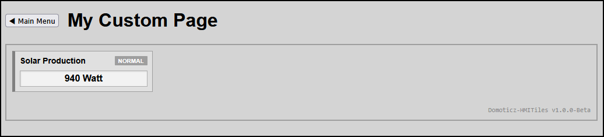

# Blueprint SingleTilePage

This quick start outlines how to create a single HMITile displaying Solar Production value (W).

## Screenshots



---

## Step 1: Create Your Domoticz Virtual Devices

Before writing the HTML layout, ensure you have created a virtual dummy device inside your Domoticz utility hardware panel. Note down their unique **IDX numbers** from your device list:

**Device 1 (Display Only):** Create an `Electric (Usage)` dummy sensor (e.g., linked to your solar output). Let's assume its ID is **`IDX 5`**.

---

## Step 2: Set Up Your Project Folder

To keep your files modular and organized, deploy your new custom template inside your standard Domoticz templates path alongside the shared common styles and engine files:

```
...domoticz/www/templates/
├── hmitiles.css               	# Shared common styling library file
├── hmitiles.js                	# Shared common javascript core engine
├── SingleTilePage.html  		# Domoticz custom page wrapper (created below)
└── singletilepage/				# Custom page folder
    └── index.html             	# Your new custom layout file (created Below)
```

---

## Step 3: Write the HTML Structure (`index.html`)

Create a new file named `index.html` inside your `singletilepage/` subfolder, open it in any text editor, and paste the following clean structure. 

**Notes**

* In the head section there are links backward (`../`) to reuse the shared asset engine files, and use a private `DOMContentLoaded` closure block to protect against global naming collisions across external files.
* Inside header set the title enclosed in `<h1>Title</h1>` or any other header level.
* In Tile 1 set the device idx according devices list.

**Content** `index.html`
```
<!DOCTYPE html>
<html lang="en">
<head>
    <meta charset="UTF-8">
    <title>My Custom Page</title>

    <!-- Link backward one folder level to reuse shared global common styles -->
    <link rel="stylesheet" href="../hmitiles.css">
	
	<!-- Link backward one folder level to the HMI tile engine -->
    <script src="../hmitiles.js" defer></script>
</head>
<body>

	<!-- Inside the header block of index.html -->
	<header class="hmi-header-container">
		<div style="display: flex; align-items: center; justify-content: space-between; width: 100%;">
			<div style="display: flex; align-items: center; gap: 15px;">
				<button class="hmi-exit-btn" onclick="goToDomoticzDashboard()">◀ Main Menu</button>
				<h1>My Custom Page</h1>
			</div>
		</div>
	</header>

    <!-- Master outer panel containing your grid -->
    <main class="hmi-panel">
        
        <!-- 
			TILE 1 ROW 1 COL 1: POWER PRODUCTION
			Set the device idx according devices list
			IDX 5
		-->
        <div class="hmi-pack-card hmi-clickable-card" data-device-idx="5" data-alarm="normal">
            <div class="hmi-card-header">
                <div class="hmi-pack-label">Solar Production</div>
                <div class="hmi-badge">NORMAL</div>
            </div>
            <div class="hmi-value-grid">
                <div class="hmi-value-box">
                    <div class="hmi-box-data">
                        <span class="hmi-value">--</span>
                    </div>
                </div>
            </div>
        </div>

		<footer class="hmi-footer-version">
			<span>Domoticz-HMITiles v1.0.0-Beta</span>
		</footer>
    </main>
</body>
</html>
```

## Step 4: Create Page wrapper (`MyCustomPage.html`)
Inside the folder `www/templates` create file `SingleTilePage.html` which calls the `index.html` located in the Folder
`www/templates/singletilepage`.

**Content** `SingleTilePage.html`

```
<script>
  window.location.href = "templates/singletilepage/index.html";
</script>
```

## Step 5: Run and Test Your Custom Page

1. Save the file.
2. Refresh the Domoticz Web UI.
3. Goto Tab Custom and select `SingleTilePage'
3. **Watch it Live:** 
   * The tile will automatically start parsing the live data from your server every 60 seconds.
   * Clicking on the tile will show device logging data in a new browser tab.
   * Note: For my tests the Solar Info data is obtained every 5 minutes via a dzVents Automation Script.
4. It is also possible to direct load your new custom page directly through your running Domoticz instance web portal:
   `http://YOUR_DOMOTICZ_IP:8080/templates/SingleTilePage.html`

---

## Key Design Best Practices
* **Never Poll Globally:** Keep page-specific thresholds and custom text evaluations out of `hmitiles.js`. Nest them locally using private arrow function expressions.
* **Isolate Selection Queries:** Always combine your selection hooks (`[data-device-idx="40"][data-type="temperature"]`) so your data routines never misidentify chart wrappers or layout modules that share index parameters.
* **Leverage Native Attributes:** Use `data-on-text` and `data-off-text` parameters straight in your HTML block tags to let the core framework translate state expressions dynamically.

