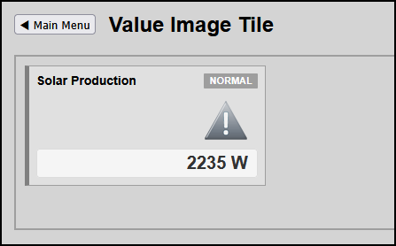

# Blueprint Create Value Image Tile

Follow this blueprint to build icon-based tiles using Domoticz images, while keeping your interface compliant with high-performance HMI design rules.

---

## Screenshots



---


## HMI Rule for Icons
* **Static Colors**: Do not use bright green, blue, or yellow icons. Icons must remain a neutral slate gray or dark charcoal during normal runtime states.
* **Saturated Alert Colors**: Saturated tones (like amber or dark red) must only appear on borders and badges when an active warning threshold is breached. The icon shape stays neutral to prevent visual fatigue.

---

## Step 1: Create HTML Tile Markup

Expected HMI Tile layout structure:
```
[Title Label] [Badge]
              [Image]
[Value Right Aligned]
```
Use this HTML boilerplate for a tile with default IDX 5 using Domoticz native gray imagery assets:

```html
<div class="hmi-pack-card" data-type="icon-tile" data-device-idx="5">
	<!-- Header block holding title and status token -->
	<div class="hmi-card-header" style="display: flex; justify-content: space-between; align-items: center;">
		<div class="hmi-pack-label">Solar Production</div>
		<div class="hmi-badge">NORMAL</div>
	</div>

	<!-- System Status Icon Row -->
	<div class="hmi-icon-wrapper" style="display: flex; justify-content: flex-end; padding: 4px 12px 0 0;">
		
	</div>
				
	<!-- Metric Data Value Area -->
	<div class="hmi-value-grid" style="display: flex; justify-content: flex-end; padding: 4px 12px 12px 0;">				
		<div class="hmi-value-box" style="text-align: right;">
			<div class="hmi-value-display" style="font-size: 20px; font-weight: bold; color: #333333;">--</div>
		</div>
	</div>
</div>
```

---

---

## CRITICAL ARCHITECTURAL RULE: Avoid Duplicate Loops

**DO NOT** create a separate `window.addEventListener('DOMContentLoaded', ...)` or secondary polling loops inside your custom pages like this:

```javascript
// BAD PRACTICE - DO NOT USE THIS IN CUSTOM PAGES
window.addEventListener('DOMContentLoaded', () => {
    fetchDomoticzData();
    setInterval(fetchDomoticzData, REFRESH_RATE);
});
```

### Why this breaks the system:
1. **Layout Crashing / Double Icons**: Your global `hmitiles.js` engine and your custom page script will query the API independently. They will trigger structural rendering at different intervals, overwriting each other and causing icons or text values to render twice or flicker.
2. **Server Overhead**: Instantiating separate timers triggers massive duplicate network polling loads on your Domoticz backend database.

Always use the **`window.onHMITileProcess`** hook blueprint described below. 
This lets you inject custom logic directly into the central main loop safely.

---

## Step 2: Add Scoped JavaScript Parsing Logic

Add this ecosystem hook algorithm into the `<head>` section of your dedicated custom page layout file. 

*Note:*
In compliance with HMI guidelines, the icon (`Alert48_0.png`) remains a neutral gray state across all thresholds, 
while the dynamic `.hmi-badge` and parent container handle visual attention routing via your desaturated CSS classes.*

```html
<script>
	// Target device tracking maps
	const POWER_FROM_SOLAR_IDX = 5;

	/**
	 * Hook function called directly by hmitiles.js whenever a tile is processed
	 */
	window.onHMITileProcess = function(tileElement, device, rawValue, displayStatus) {
		// Only run this custom code if we are processing our specific Solar tile
		if (parseInt(device.idx, 10) !== POWER_FROM_SOLAR_IDX) {
			return false; // Let hmitiles.js handle all other tiles normally
		}

		// 1. Map industrial process thresholds
		const normal = 2000;
		const warning = 1000;
		const critical = 500;

		// 2. Parse out our current power value
		const dataValue = parseInt(device.Data, 10) || 0;

		// 3. Find our elements inside this specific tile card
		const valueDisplay = tileElement.querySelector('.hmi-value-display');
		const badge = tileElement.querySelector('.hmi-badge');
		const iconImg = tileElement.querySelector('.hmi-icon-wrapper img');
		
		let alarmState = "normal";
		let badgeText = "NORMAL";
		let iconSrc = "/images/Alert48_0.png"; // Stays neutral gray for high-performance HMI safety

		// 4. Industrial Threshold State Evaluation Flow
		if (dataValue >= normal) {
			alarmState = "normal";
			badgeText = "NORMAL";
		} else if (dataValue >= warning) {
			alarmState = "warning";
			badgeText = "WARNING";
		} else {
			alarmState = "critical"; // Matches your specific CSS attribute selector
			badgeText = "CRITICAL";
		}

		// 5. Update UI DOM Elements Safely
		if (valueDisplay) {
			valueDisplay.textContent = `${dataValue} W`;
		}

		if (badge) {
			badge.textContent = badgeText;
		}

		if (iconImg) {
			iconImg.src = iconSrc;
			iconImg.alt = badgeText;
		}

		// Apply a dynamic data attribute to the card for container color morphing
		tileElement.setAttribute("data-alarm", alarmState);

		return true; // Tells hmitiles.js to bypass generic overriding
	};

	function goToDomoticzDashboard() {
		window.location.href = "../index.html"; 
	}
</script>
```

---

## Step 3: Append the CSS Definitions (`hmitiles.css`)

Add these precise, desaturated rule setups to your shared global stylesheet to handle high-performance layout colorization based on data attributes.

```css
/* Ensure crisp rendering for pixelated or low-res server assets */
.hmi-icon-wrapper img {
    image-rendering: pixelated;
    image-rendering: crisp-edges;
}

/* Card desaturated Alarm States */
.hmi-pack-card[data-alarm="warning"] {
    border-color: #d1a119 !important; /* Muted Amber */
}
.hmi-pack-card[data-alarm="warning"] .hmi-badge {
    background-color: #d1a119 !important;
    color: #ffffff;
}

.hmi-pack-card[data-alarm="critical"] {
    border-color: #b33c3c !important; /* Desaturated Red */
}
.hmi-pack-card[data-alarm="critical"] .hmi-badge {
    background-color: #b33c3c !important;
    color: #ffffff;
}
```

---


