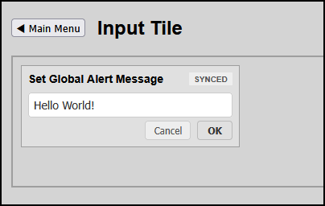

# Blueprint: Text Input Action Tile

This blueprint demonstrates how to create an interactive data entry tile to update a Domoticz Text Device string natively from a custom dashboard view.

---

## Screenshots



---

## High-Performance HMI Design Rules
* **Focused State Synchronization**: The input field uses `document.activeElement` detection rules to disconnect global network polling overwrites while the operator is actively editing content.
* **Muted Context States**: The component avoids vivid attention-grabbing elements for basic interaction loops, changing the badge to a soft amber background color strictly during an active `EDITING` transaction profile.

---

## Step 1: Interface Layout Markup

Place this responsive grid card module inside your dashboard page's `<main>` container block:

```html
<div class="hmi-pack-card" data-device-idx="30" data-type="text-input">
	<div class="hmi-card-header">
		<div class="hmi-pack-label">Set Global Alert Message</div>
		<div class="hmi-badge">SYNCED</div>
	</div>

	<div class="hmi-value-grid" style="display: flex; flex-direction: column; padding: 12px; gap: 12px;">
		
		<!-- INPUT FIELD (With full-width alignment) -->
		<div style="width: 100%;">
			<input type="text" class="hmi-text-field" placeholder="Enter status text..." 
				   style="width: 100%; padding: 6px; font-size: 14px; border: 1px solid #ccc; border-radius: 4px; color: #333333; box-sizing: border-box;">
		</div>
		
		<!-- ACTION ROW (Pushed lower with 4px top margin spacing padding) -->
		<div class="hmi-action-row" style="display: flex; justify-content: flex-end; width: 100%; gap: 8px; margin-top: 4px;">
			<button class="hmi-btn-cancel" style="padding: 4px 10px; font-size: 12px; cursor: pointer; background: #eeeeee; border: 1px solid #cccccc; color: #555555; border-radius: 4px;">Cancel</button>
			<button class="hmi-btn-ok" style="padding: 4px 12px; font-size: 12px; cursor: pointer; background: #e0e0e0; border: 1px solid #bbbbbb; color: #333333; font-weight: bold; border-radius: 4px;">OK</button>
		</div>

	</div>

</div>
```

---

## Step 2: Add Scoped JavaScript Parsing Hook

Map this conditional evaluation statement directly into your custom page's `window.onHMITileProcess` framework array tree. Ensure you update `TEXT_INPUT_IDX` to match your target virtual hardware device register profile:

```html
<script>
	// Target device configuration register
	const TEXT_INPUT_IDX = 30;

	/**
	 * Hook function called directly by hmitiles.js whenever a tile is processed
	 */
	window.onHMITileProcess = function(ignoredTileParam, device, rawValue, displayStatus) {
		const currentIdx = parseInt(device.idx, 10);

		if (currentIdx === TEXT_INPUT_IDX) {
			const textCard = document.querySelector(`[data-device-idx="${TEXT_INPUT_IDX}"][data-type="text-input"]`);
			if (textCard) {
				const inputField = textCard.querySelector('.hmi-text-field');
				const badge = textCard.querySelector('.hmi-badge');
				
				// Block background loop updates if field focus is currently claimed by operator
				if (inputField && document.activeElement !== inputField) {
					inputField.value = device.Data || "";
					if (badge) {
						badge.textContent = "SYNCED";
						badge.style.background = "#eeeeee";
						badge.style.color = "#555555";
					}
				}
				
				// Bind event transaction handlers once on deployment initialization pass
				if (!textCard.hasAttribute('data-listeners-bound')) {
					setupTextInputListeners(textCard, TEXT_INPUT_IDX);
				}
			}
			return true; // Command processed completely, skip generic overriding
		}
		
		return false; // Yield to standard router engines for other modules
	};

	/**
	 * Binds input field mutation loops and REST api callbacks
	 */
	function setupTextInputListeners(cardElement, idx) {
		cardElement.setAttribute('data-listeners-bound', 'true');
		
		const inputField = cardElement.querySelector('.hmi-text-field');
		const btnOk = cardElement.querySelector('.hmi-btn-ok');
		const btnCancel = cardElement.querySelector('.hmi-btn-cancel');
		const badge = cardElement.querySelector('.hmi-badge');

		// Transition state flag cleanly when editing operations start
		inputField.addEventListener('input', () => {
			if (badge) {
				badge.textContent = "EDITING";
				badge.style.background = "#fff3cd"; // Soft, low-contrast warning tint
				badge.style.color = "#856404";
			}
		});

		// Cancel Action: drops focus boundaries and forces a server state synchronization refetch
		btnCancel.addEventListener('click', () => {
			inputField.blur();
			if (typeof fetchDomoticzData === 'function') {
				fetchDomoticzData();
			}
		});

		// OK Action: Encodes current parameter value and uploads string payload to database
		btnOk.addEventListener('click', async () => {
			const targetValue = inputField.value;
			inputField.blur();
			
			if (badge) badge.textContent = "SAVING...";

			try {
				const updateUrl = `${DOMOTICZ_URL}/json.htm?type=command&param=udevice&idx=${idx}&nvalue=0&svalue=${encodeURIComponent(targetValue)}`;
				const response = await fetch(updateUrl);
				
				if (response.ok) {
					console.log(`[${new Date().toLocaleTimeString()}] Pushed text to IDX ${idx}: "${targetValue}"`);
					if (badge) badge.textContent = "SAVED";
					
					if (typeof fetchDomoticzData === 'function') {
						fetchDomoticzData();
					}
				}
			} catch (err) {
				console.error(`Failed to upload text payload to Domoticz register ${idx}:`, err);
				if (badge) badge.textContent = "ERR";
			}
		});
	}
</script>
```
