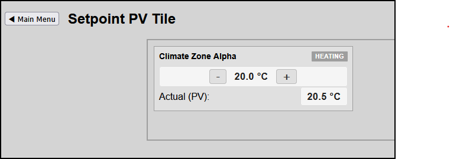

# Blueprint: Generic Setpoint Stepper with Process Value (PV)

This blueprint demonstrates how to build an interactive dual-variable control tile that pairs a Target Setpoint (SP) value with step-incrementers `[-]` / `[+]` directly alongside its real-time Actual Process Value (PV) sensor feedback channel inside a single modular card.

---

## Screenshots



---

## High-Performance HMI Design Rules (ISA-101)
* **Co-Located Visual Analytics**: Operators can instantly verify if a setpoint modification drives the physical hardware process state change effectively without switching between separate text logs or sensor grid dashboards.
* **Typographic Contrast Hierarchy**: The critical numerical metrics remain bold and high-contrast, while secondary static operational field markers (`Actual (PV):`) use a muted charcoal layout presentation to minimize screen fatigue.

---

## Step 1: Interface Component Layout Markup

Add this responsive industrial component frame into your custom layout dashboard page file:

```html
<div class="hmi-pack-card" data-device-idx="1" data-type="setpoint-stepper-tile" data-pv-idx="2" data-unit="°C" data-step="0.5">
    <div class="hmi-card-header">
        <div class="hmi-pack-label">Climate Zone Alpha</div>
        <div class="hmi-badge">HEATING</div>
    </div>
    
    <div class="hmi-value-grid">
        <!-- ROW 1: Interactive Target Setpoint Stepper Control (SP) -->
        <div class="hmi-stepper-row">
            <button class="hmi-btn-step hmi-btn-down">-</button>
            <div class="hmi-sp-value hmi-value" style="font-size: 16px; width: 80px; text-align: center;">--</div>
            <button class="hmi-btn-step hmi-btn-up">+</button>
        </div>
        
        <!-- ROW 2: Read-Only Actual Hardware Sensor Feedback (PV) -->
        <div class="hmi-pv-row">
            <span class="hmi-column-label" style="margin-bottom: 0;">Actual (PV):</span>
            <div class="hmi-value-box" style="width: auto; min-width: 80px;">
                <div class="hmi-pv-value hmi-value" style="font-size: 16px;">--</div>
            </div>
        </div>
    </div>
</div>
```

---

## Step 2: Global Stylesheet Definition (`hmitiles.css`)

Ensure these style class blocks are appended into your global framework CSS file to eliminate layout hardcoding dependencies:

```css
/* Core element spacing inside the card grid frame */
.hmi-pack-card[data-type="setpoint-stepper-tile"] .hmi-value-grid {
    display: flex;
    flex-direction: column;
    padding: 12px;
    gap: 10px;
}

/* Horizontal input element bar wrapping the buttons and SP number */
.hmi-stepper-row {
    display: flex;
    align-items: center;
    justify-content: center;
    width: 100%;
    gap: 12px;
    background-color: #f5f5f5;
    border: 1px solid #dcdcdc; 
    border-radius: 4px;
    padding: 4px;
    box-sizing: border-box;
}

/* Stepper push buttons */
.hmi-btn-step {
    padding: 2px 10px;
    font-size: 16px;
    font-weight: bold;
    cursor: pointer;
    background: #e0e0e0;
    border: 1px solid #bbbbbb;
    color: #333333;
    border-radius: 4px;
    user-select: none;
    transition: background 0.1s ease;
}

.hmi-btn-step:active {
    background: #cccccc;
}

/* Horizontal structural wrapper for the Actual sensor row */
.hmi-pv-row {
    display: flex;
    justify-content: space-between;
    align-items: center;
    width: 100%;
}
```

---

## Step 3: Core Framework Engine Integration (`hmitiles.js`)

This generic pipeline block executes inside the central `processDevices` handler, updating states dynamically and wiring up input callbacks on the fly without duplicative script scopes:

```javascript
if (cardType === "setpoint-stepper-tile") {
    const spField = tileElement.querySelector('.hmi-sp-value');
    const pvField = tileElement.querySelector('.hmi-pv-value');
    
    const targetPVIdx = tileElement.getAttribute('data-pv-idx');
    const targetUnit = tileElement.getAttribute('data-unit') || "";
    const stepValue = parseFloat(tileElement.getAttribute('data-step') || 0.5);

    // 1. Sync current Target Setpoint (SP)
    const currentSP = parseFloat(device.SetPoint || device.Data || 0);
    if (spField) spField.textContent = `${currentSP.toFixed(1)} ${targetUnit}`;

    // 2. Cross-reference the database array payload to pull the process value (PV)
    if (targetPVIdx) {
        const pvDevice = devices.find(d => String(d.idx) === String(targetPVIdx));
        if (pvDevice && pvField) {
            const currentPV = parseFloat(pvDevice.Temp || pvDevice.Data || 0);
            pvField.textContent = `${currentPV.toFixed(1)} ${targetUnit}`;
        }
    }

    // 3. Bind click listener transaction pipelines securely on initial loop pass
    if (!tileElement.hasAttribute('data-listeners-bound')) {
        tileElement.setAttribute('data-listeners-bound', 'true');
        
        const btnUp = tileElement.querySelector('.hmi-btn-up');
        const btnDown = tileElement.querySelector('.hmi-btn-down');
        let workingSP = currentSP;

        const sendSetpointUpdate = async (newVal) => {
            if (spField) spField.textContent = `${newVal.toFixed(1)} ${targetUnit}`;
            try {
                const targetUrl = `${DOMOTICZ_URL}/json.htm?type=command&param=setsetpoint&idx=${device.idx}&setpoint=${newVal.toFixed(1)}`;
                await fetch(targetUrl);
            } catch (err) {
                console.error("Setpoint transmission error:", err);
            }
        };

        if (btnUp) {
            btnUp.addEventListener('click', () => {
                workingSP += stepValue;
                sendSetpointUpdate(workingSP);
            });
        }

        if (btnDown) {
            btnDown.addEventListener('click', () => {
                workingSP -= stepValue;
                sendSetpointUpdate(workingSP);
            });
        }
    }

    checkAlarmThresholds(device.idx, rawValue);
    return;
}
```
