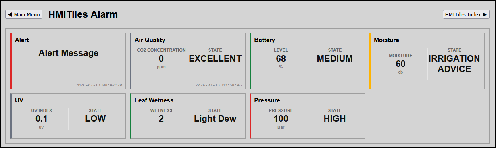

# Alarm

------------------------------
## Unified Alarm & State Engine (Adaptive Multi-Tier Dashboard Matrix)
The Adaptive Alarm Engine consolidates numeric thresholds, display state labels, and chromatic severity borders into a single, high-performance declaration loop. By evaluating a linear string array via data-state-map, it handles ascending spikes (e.g., Air Quality), falling drainages (e.g., Battery SOC), or specific multi-state steps natively without data duplication.

**Preview**


## Configuration Parameters (HTML Data Attributes)

| Attribute | Expected Value | Description |
|---|---|---|
| data-alarm-direction | up or down | up: Higher numbers intensify alarms (climbing scale). down: Lower numbers intensify alarms (dropping scale). |
| data-state-map | Value:Text, ... | Comma-separated list of threshold checkpoints mapped directly to dynamic 4px ISA-101 color tiers (gray, green, yellow, orange, red) based on overall rule array length. |

------------------------------
## Production Template Implementations## 1. Ascending Spikes (5-Tier Air Quality Monitor)

```
<div class="hmi-pack-tile hmi-clickable-tile" 
     data-device-idx="3" data-type="value" data-alarm-direction="up"
     data-labels="0:CO2 Concentration:ppm;1:STATE:"
     data-state-map="0:EXCELLENT,700:GOOD,900:FAIR,1100:MEDIOCRE,1600:BAD">
    <div class="hmi-tile-header"><div class="hmi-pack-label">Air Quality</div></div>
    <div class="hmi-value-grid"></div>
    <div class="hmi-last-update"></div>
</div>
```

## 2. Descending Drainage (4-Tier Battery Bank Monitor)

```
<div class="hmi-pack-tile hmi-clickable-tile" 
     data-device-idx="4" data-type="value" data-alarm-direction="down"
     data-labels="0:Level:%;1:STATE:"
     data-state-map="100:FULL,90:MEDIUM,20:LOW,5:EMPTY">
    <div class="hmi-tile-header"><div class="hmi-pack-label">Battery Bank</div></div>
    <div class="hmi-value-grid"></div>
    <div class="hmi-last-update"></div>
</div>
```

## 3. Binary Interlock Safety Switch (2-State Fluid Leak / Contact Sensor)
Note: Shorter 2-state arrays dynamically bypass intermediate colors, snapping instantly from Normal (Gray/Green) to High-Priority Alert (Red).

```
<div class="hmi-pack-tile hmi-clickable-tile" 
     data-device-idx="26" data-type="value" data-alarm-direction="up"
     data-labels="0:Basement Status:;1:STATE:"
     data-state-map="0:DRY,1:LEAK DETECTED">
    <div class="hmi-tile-header"><div class="hmi-pack-label">Flood Detection</div></div>
    <div class="hmi-value-grid"></div>
    <div class="hmi-last-update"></div>
</div>
```

------------------------------
## Semantic State Label Blueprints (Solar / Power Optimization Profiles)
To tailor the state readout text inside your data-state-map fields for generation or consumption metrics, choose from these high-contrast industrial vocabulary profiles:

* Profile A: Clean & Technical (Generation Focus)
0:NO PROD, 1000:LOW, 2000:MODERATE, 3000:OPTIMAL, 5000:PEAK
* Profile B: Simple & Intuitive (General Use)
0:OFF, 1000:WEAK, 2000:NORMAL, 3000:GOOD, 5000:MAX
* Profile C: Action-Oriented (Household Load Management)
0:IDLE, 1000:BASELOAD, 2000:ACTIVE, 3000:SURPLUS, 5000:OVERFLOW (Tells operators exactly when to run heavy appliances or charge EVs)

------------------------------

