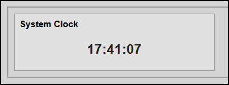

# CLOCK

**Data Type**: `clock`

---

## Overview
The `clock` tile engine provides an autonomous, high-performance real-time clock displaying local client-side time updating every second. 

To maintain maximum engine performance, it completely bypasses the Domoticz backend data loop. By isolating execution entirely inside the browser using a drift-synchronized worker, it avoids unnecessary network requests and server overhead while perfectly mimicking your dashboard's standard tile layout.

**Preview**


**IMPORTANT**
Check `index.html` for implementation reference.

---

## Configuration Parameters 
(HTML Data Attributes)

Configure the following attributes on the `.hmi-pack-tile` chassis to deploy a standalone clock instance.

| Attribute | Expected Value | Description |
|-----------|----------------|-------------|
| `data-type` | `"clock"` | Explicitly targets the isolated real-time client loop engine. |
| `data-clock-format` | `"HH:mm:ss"` or `"HH:mm"` | Optional format toggle to display or hide the running seconds readout. |

### Engineering Best Practices
* **Instance Limitations:** Only **ONE** clock tile can be defined per custom dashboard page layout. The initialization engine relies on a single persistent element binding structure (`#hmi-live-clock`).
* **Zero Backend Overhead:** Do not attach a `data-device-idx` attribute to this tile type. Keeping it separate ensures your Domoticz state-update processors skip past it entirely during real-time network poll operations.
* **Layout Reusability:** The markup structure retains the exact global styling hooks (like `.hmi-pack-tile` and `.hmi-value-grid`) ensuring perfect visual harmony with standard sensor counters.

---

### Standalone Local Clock Mode
Generates a drift-synchronized, centered live-time string directly inside the default container grid element.

```html
<div class="hmi-pack-tile" 
     data-type="clock"
     data-clock-format="HH:mm:ss">
     <div class="hmi-tile-header"><div class="hmi-pack-label">System Clock</div></div>
     <div class="hmi-value-grid" id="hmi-live-clock">--:--:--</div>
</div>
```

---

## Hints
* **Text Jitter Elimination:** To prevent numbers from shifting horizontally and vibrating every second, your CSS must enforce `font-variant-numeric: tabular-nums;`. This forces variable-width numbers (like `1` and `8`) into an identical layout spacing block.
* **Layout Isolation Override:** Target `[data-type="clock"] .hmi-value-grid` with `display: block` and `width: 100%` in your stylesheet to break free from layout restrictions and center the time string perfectly within the tile workspace boundaries.
* **Precision Interval Synchronization:** The underlying JavaScript engine actively computes the exact millisecond deficit to the next physical system clock rollover before triggering its main loop sequence, preventing rendering delay stutters.
