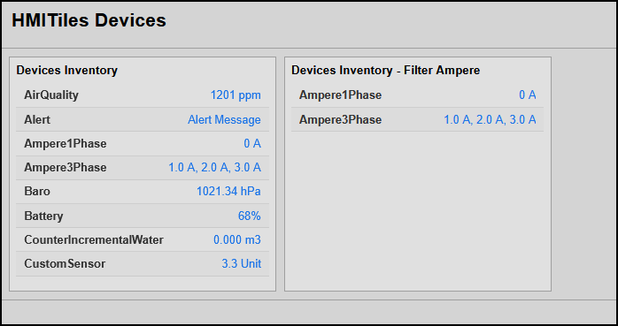

# DEVICES

**Data-Type**: devices

---

## Overview
This extension implements a high-density, system-wide modular list component tile. It automatically queries all active, used Domoticz hardware nodes and maps their primary live status values directly onto a clean, space-saving inventory ledger.

**Preview**


> [!NOTE]
> **IMPORTANT:** Check `index.html` for the latest implementation examples.

---

## Configuration Parameters
To insert an inventory overview list anywhere on your dashboard, simply configure the following core layout attributes on a standard `.hmi-pack-tile` element.

| Attribute | Expected Value | Description |
| :--- | :--- | :--- |
| `data-device-idx` | `"0"` | Set to `0` to signal to the preprocessor engine that this tile handles system-wide configurations rather than a singular hardware component. |
| `data-type` | `"devices"` | Tells the core processor engine to initialize the synchronized device list pipeline inside the card grid. |
| `data-max-height` | `"NNNpx"` *(Optional)* | Enforces a custom physical layout boundary limit on the internal scrollable container frame directly from HTML. |
| `data-filter` | `"Text"` *(Optional)* | Activates a case-insensitive string filter matching against the device name (`device.Name`) to narrow down the visible results. |

---

## How It Works
Instead of manually mapping status layouts for every sensor or logger across heavy dashboard profiles, the processor executes a unified network cycle to build this view block:

1. **DOM Evaluation:** The parsing thread matches your layout tags for any tile using `data-type="devices"` and extracts any active custom parameters (`data-max-height` or `data-filter`).
2. **Payload Fetch Request:** It triggers a background asynchronous network call to pull the complete list of system assets:  
   `http://IP:PORT/json.htm?type=command&param=getdevices&used=true`
3. **Array Parsing & Filtering:** It loops over the returned data, runs your optional case-insensitive text string parameter search against `device.Name`, and excludes non-matching records in memory.
4. **ISA-101 Text Alignment Formatting:** It converts the remaining datasets into strict high-density listing lines, pairing left-aligned bold device names with right-aligned blue process telemetry values.
5. **Frame Allocation Transformation:** It injects the HTML layout strings cleanly directly inside the card container's `.hmi-value-grid` and enforces a locked track vertical scroll viewport (`overflow-y: scroll`) to prevent layout horizontal shifts when values change.

---

## Tile Code Setup (`index.html`)
To deploy this high-density device inventory ledger alongside your regular gauges, meters, or buttons, configure your layout file using the following structure snippet blocks:

```html
<!-- Fully decoupled, modular tile structure ready for the processor grid -->
<div class="hmi-pack-tile" data-device-idx="0" data-type="devices" data-max-height="320px">
    <div class="hmi-tile-header">
        <div class="hmi-pack-label">Devices Inventory</div>
    </div>
    
    <!-- The scrolling box acts as the value layout grid segment -->
    <div class="hmi-value-grid hmi-device-scroll-container">
        <div class="hmi-loading">Querying Domoticz devices...</div>
    </div>
</div>
```

---

## HTML Configuration Examples
You can pass custom attributes to isolate specific smart home hardware types or restrict screen space usages based on the physical dashboard requirements.

### Example 1: Specialized Sensor Filtering
This card isolates and lists only devices containing the word "Ampere" in their name, constrained to a maximum vertical height footprint of 250 pixels:
```html
<div class="hmi-pack-tile" data-device-idx="0" data-type="devices" data-filter="Ampere" data-max-height="250px">
    <div class="hmi-tile-header">
        <div class="hmi-pack-label">Power Telemetry Ledger</div>
    </div>
    <div class="hmi-value-grid hmi-device-scroll-container">
        <div class="hmi-loading">Querying power sensors...</div>
    </div>
</div>
```

### Example 2: General System Overview
A broader card configuration that lists all active devices with a generous, deep scroll area footprint:
```html
<div class="hmi-pack-tile" data-device-idx="0" data-type="devices" data-max-height="450px">
    <div class="hmi-tile-header">
        <div class="hmi-pack-label">Full System Status Ledger</div>
    </div>
    <div class="hmi-value-grid hmi-device-scroll-container">
        <div class="hmi-loading">Querying active assets...</div>
    </div>
</div>
```
