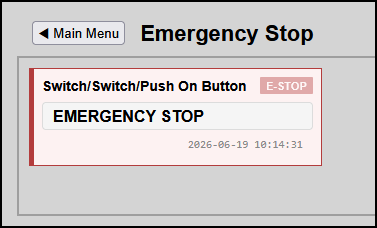

# Emergency Stop Button Tile (Safety Switch)

This document explains how to implement a high-visibility, persistent **Emergency Stop Button (E-STOP)** using the native HMITiles framework infrastructure. 

---

--- 

## The Challenge with Momentary Buttons
In Domoticz, safety devices like an Emergency Stop are often configured as a **Push On Button**. 
These are momentary switches: when clicked, they briefly fire an `ON` signal to trigger your backend safety script, but their database state instantly reverts or stays `OFF`. 

When a standard monitoring page polls the API, a momentary button will flash red for a second and then instantly revert to a "Normal" state.

## The Pure HTML Solution (No JS Modification Required)
Instead of modifying `hmitiles.js` with complex custom exceptions, we can leverage the built-in `checkAlarmThresholds` engine. By smart-mapping both binary switch possibilities (`0` for OFF, `1` for ON) to a **critical** state response, the tile is mathematically locked into a red warning layout regardless of what Domoticz polls.

### Why It Works:
* When the switch is **OFF** (`rawValue = 0`), it matches `data-level-info="0"` $\rightarrow$ Triggers **Critical**
* When the switch is clicked **ON** (`rawValue = 1`), it matches `data-level-critical="1"` $\rightarrow$ Triggers **Critical**

---

## HTML Implementation Blueprint
See example emergencystopbuttontile/index.html.

---
