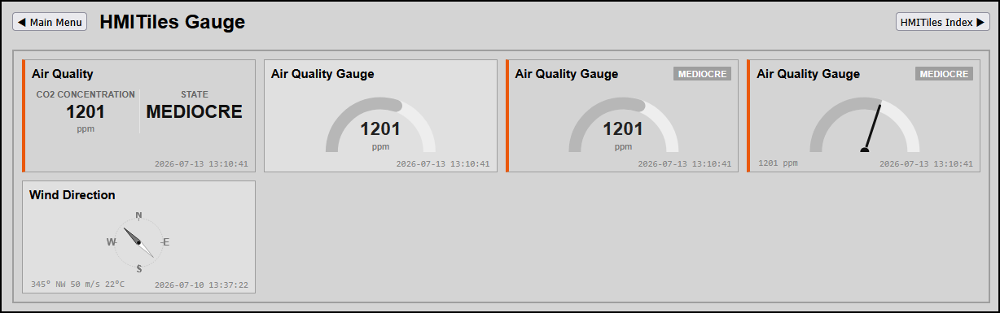

# Gauge

------------------------------
## Radial Gauge Components (data-type="gauge")
Gauge tiles display real-time sensor metrics using high-contrast vector arc indicators or high-precision needle pointers. Gauges bypass the multi-column splitter and read your framework's synchronized presentation properties (device.tileValue and device.tileUnit) directly from the pre-parser for smooth visual rendering.

**Preview**


## Gauge Configuration Markups## 1. Standard Minimalist Arc Gauge
Renders a clean, circular fill track that scales dynamically with the incoming sensor number.

```
<div class="hmi-pack-tile hmi-clickable-tile" 
     data-device-idx="85" data-type="gauge" data-unit="lux">
    <div class="hmi-tile-header"><div class="hmi-pack-label">Solar Radiance</div></div>
    <div class="hmi-value-grid"></div>
    <div class="hmi-last-update"></div>
</div>
```

## 2. Integrated State & Threshold Gauge
Combines dynamic circular fills with an active text status badge driven by your unified threshold array.

```
<div class="hmi-pack-tile hmi-clickable-tile" 
     data-device-idx="3" data-type="gauge" data-unit="ppm"
     data-alarm-direction="up"
     data-state-map="0:EXCELLENT,700:GOOD,900:FAIR,1100:MEDIOCRE,1600:BAD">
    <div class="hmi-tile-header"><div class="hmi-pack-label">Air Quality Index</div></div>
    <div class="hmi-value-grid"></div>
    <div class="hmi-last-update"></div>
</div>
```

## 3. High-Precision 180° Needle Dial Gauge
Renders a classic industrial pointer dial, ideal for critical infrastructure metrics like water pressure or line voltage.

```
<div class="hmi-pack-tile hmi-clickable-tile" 
     data-device-idx="94" data-type="gauge" data-variant="needle" data-unit="bar"
     data-alarm-direction="up"
     data-state-map="0:NORMAL,4:WARNING,7:CRITICAL">
    <div class="hmi-tile-header"><div class="hmi-pack-label">Main Line Pressure</div></div>
    <div class="hmi-value-grid"></div>
    <div class="hmi-last-update"></div>
</div>
```

------------------------------
## Unified Dark Theme Symmetries (hmitiles-dark.css)

* Hover State Immunity: To ensure absolute visual stability inside your experimental dark theme, gauges utilize a 1-line layout pointer shield:

.theme-dark .hmi-pack-tile[data-type="gauge"]:hover {
    pointer-events: none !important;
}


* This forces vector paths, arcs, and background fills to ignore mouse interactions entirely, locking your dark theme tokens and custom alert color fills firmly in place with no visual flickering.

------------------------------
