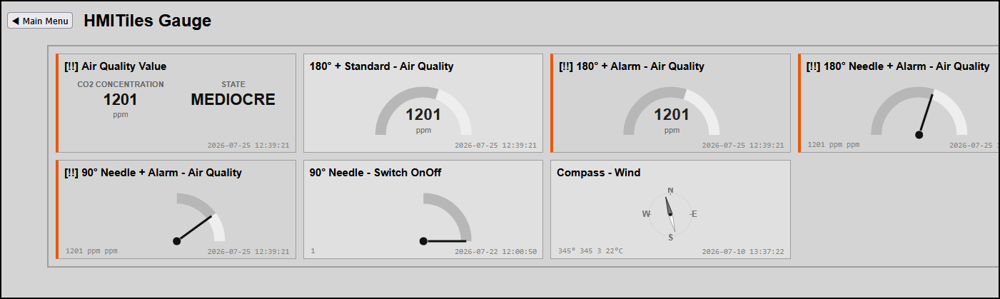

# GAUGE

**Data Type**: `gauge`, `gaugeneedle`, `gauge90needle`.

---

## Overview
The Gauge tiles display real-time sensor metrics using high-contrast vector arc indicators or high-precision needle pointers. 

Gauges bypass the multi-column splitter and read the framework's synchronized presentation properties (device.tileValue and device.tileUnit) directly from the pre-parser for smooth visual rendering.

**Preview**


**IMPORTANT**
Lookup `index.html` for latest examples.

## Configuration Parameters 
(HTML Data Attributes)
To build out dashboard data grid columns, configure the following core attributes on the `.hmi-pack-tile` chassis.

| Attribute | Expected Value | Description |
|-----------|----------------|-------------|
|`data-type`|"gauge","gaugeneedle", "gauge90needle"|Tells the JavaScript loop to register this card into the server log stream synchronization pipeline.|
|`data-device-idx`|"NNN"|Domoticz device index (`idx`) (mandatory).|
|`data-unit`  |"UNIT"          | Value unit displayed with the value above the bar. |

## Gauge Configuration Markups

## 1. Standard Minimalist Arc Gauge
Renders a clean, circular fill track that scales dynamically with the incoming sensor number.

```
<div class="hmi-pack-tile hmi-clickable-tile" 
     data-device-idx="85" 
	 data-type="gauge" 
	 data-unit="lux">
    <div class="hmi-tile-header"><div class="hmi-pack-label">Solar Radiance</div></div>
    <div class="hmi-value-grid"></div>
    <div class="hmi-last-update"></div>
</div>
```

## 2. Integrated State & Threshold Gauge
Combines dynamic circular fills with an active text status badge driven by the unified threshold array.

```
<div class="hmi-pack-tile hmi-clickable-tile" 
     data-device-idx="3" 
	 data-type="gauge" 
	 data-unit="ppm"
     data-alarm-direction="up"
     data-state-map="0:EXCELLENT,700:GOOD,900:FAIR,1100:MEDIOCRE,1600:BAD">
    <div class="hmi-tile-header"><div class="hmi-pack-label">Air Quality Index</div></div>
    <div class="hmi-value-grid"></div>
    <div class="hmi-last-update"></div>
</div>
```

## 3. High-Precision 180° Needle Dial Gauge
Renders a classic industrial pointer dial, ideal for critical infrastructure metrics like water pressure or line voltage.

```
<div class="hmi-pack-tile hmi-clickable-tile" 
     data-device-idx="94" 
	 data-type="gauge" 
	 data-needle="1"
	 data-unit="bar"
     data-alarm-direction="up"
     data-state-map="0:NORMAL,4:WARNING,7:CRITICAL">
    <div class="hmi-tile-header"><div class="hmi-pack-label">Main Line Pressure</div></div>
    <div class="hmi-value-grid"></div>
    <div class="hmi-last-update"></div>
</div>
```

---
