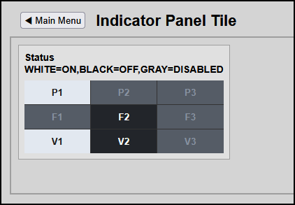

# Indicator Panel Data Flow and Status Guide

This guide explains how the High-Performance Grid Indicator Panel retrieves real-time data from a live Domoticz backend server and maps it to the user interface.

---



---

## 1. The Structure of the Domoticz API Response

When the script fires `param=getdevices&rid=41,42,43...`, Domoticz returns a single JSON payload. 
Inside that payload is a `result` array containing data objects for each requested device index. 

Here is what the raw data looks like for a real device:

```json
{
   "status" : "OK",
   "result" : [
      {
         "idx" : "41",
         "Name" : "Main Circulating Pump 1",
         "Status" : "On",
         "Data" : "On"
      },
      {
         "idx" : "49",
         "Name" : "Exhaust Fan 9 Anomaly",
         "Status" : "Error",
         "Data" : "Error"
      }
   ]
}
```

---

## 2. How the JavaScript Maps the Live Status

Look closely at this specific section inside your production `fetchDomoticzMatrixStatus()` function in `hmitiles.js`:

```javascript
// 1. Find the specific device returned by Domoticz that matches this cell's target IDX
const deviceData = data.result.find(d => String(d.idx) === String(targetIdx));

if (deviceData) {
    // 2. Extract the real-time status string natively sent by the Domoticz engine
    const statusText = String(deviceData.Status || deviceData.Data || "").toUpperCase();
    
    // 3. Evaluate the text strings and instantly toggle the CSS layout classes
    if (statusText === "ERROR" || statusText === "ALARM" || statusText === "OFF") {
        cellElement.classList.add('state-error');    // Turns Black
    } else if (statusText === "DISABLED" || statusText === "GRAY" || statusText === "NONE") {
        cellElement.classList.add('state-disabled'); // Turns Gray
    } else {
        cellElement.classList.add('state-ok');       // Turns White (Matches "ON", "RUNNING", "OK", etc.)
    }
}
```

---

## 3. How to Control the Cell Colors from Your Real Setup

Because the JavaScript normalizes the text strings by forcing them to uppercase, your matrix responds automatically to standard Domoticz hardware events or dzVents backend logic switches:

* **To make a cell turn WHITE**: Simply turn the real device **ON** in Domoticz (Status evaluates to: "On", "Normal", or "OK").
* **To make a cell turn BLACK**: Turn the real device **OFF** in Domoticz (Status evaluates to: "Off"), or trigger a software state fault (Status evaluates to: "Error" or "Alarm").
* **To make a cell turn GRAY**: Put the device into a bypassed state via a script sequence (Status evaluates to: "Disabled" or "None").
