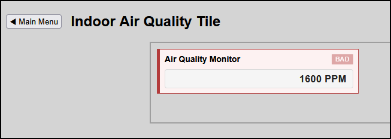

### 🍃 Indoor Air Quality & 5-Level Alarm Matrix Tile

The **Indoor Air Quality Tile** leverages an advanced, generic **5-Level Alarm Severity Matrix** (`Info`, `Low`, `Medium`, `High`, `Critical`) to monitor environmental parameters. 
By driving all threshold boundaries and status strings entirely through HTML data attributes, the implementation remains 100% generic, reusable, and free from hardcoded sensor logic.



#### ✨ Key Features
* **100% Generic Utility**: Zero sensor-specific or air quality terminology exists inside the JavaScript engine. The layout adapts to any numeric device tracking multi-stage bounds.
* **ISA-101 High-Performance Compliance**: Suppresses noisy alert colors during peaceful conditions while automatically shifting text states and activating high-contrast warning bars (`hmi-warning-state` / `hmi-alarm-state`) during threshold transitions.
* **Extensible Architecture**: This single component layout functions as an instant blueprint for water tank depths, grid voltages, or server temperatures by changing metadata flags.

---

#### 🛠️ HTML Template Configuration

Add this structural tile layout to your dashboard framework template file. All operational behavior and text output layers are driven dynamically from the custom data variables:

```html
<!-- AIR QUALITY MONITOR / 5-LEVEL SEVERITY MATRIX ALARM TILE -->
<div class="hmi-pack-card" data-type="alarm" data-device-idx="23" 
     data-level-info="700"      data-text-info="Good"
     data-level-low="900"       data-text-low="Fair"
     data-level-medium="1100"    data-text-medium="Mediocre"
     data-level-high="1600"      data-text-high="Bad"
     data-text-normal="Excellent">
    
    <div class="hmi-card-header">
        <div class="hmi-pack-label">Air Quality Monitor</div>
        <div class="hmi-badge hmi-clickable-badge">EXCELLENT</div>
    </div>
    <div class="hmi-value-grid">
        <div class="hmi-value-box">
            <div class="hmi-box-data">
                <span class="hmi-value">--</span>
            </div>
        </div>
    </div>
</div>
```

---

#### ⚙️ Upgraded Generic Threshold Evaluation Engine (`hmitiles.js`)

Ensure your global checking utility function is updated to sort descending threshold parameters sequentially. This reads values cleanly from the DOM without hardcoded device associations:

```javascript
/**
 * Evaluates live metrics against a generic 5-level alarm severity matrix.
 * @function checkAlarmThresholds
 * @param {number} idx - The unique Domoticz database hardware index identifier code.
 * @param {number} currentValue - The raw numeric value calculation used to determine warning states.
 */
function checkAlarmThresholds(idx, currentValue) {
    const card = document.querySelector(`[data-device-idx="${idx}"]`) || document.getElementById(`idx-${idx}`);
    if (!card) return;

    const lvlInfo   = card.getAttribute('data-level-info');
    const lvlLow    = card.getAttribute('data-level-low');
    const lvlMedium = card.getAttribute('data-level-medium');
    const lvlHigh   = card.getAttribute('data-level-high');

    if (lvlInfo === null && lvlLow === null && lvlMedium === null && lvlHigh === null) return; 

    const badge = card.querySelector('.hmi-badge');
    let state = "normal";
    let badgeText = card.getAttribute('data-text-normal') || "NORMAL";
    const val = parseFloat(currentValue);

    // Process descending threshold boundaries (Highest severity checks go first)
    if (lvlHigh !== null && val >= parseFloat(lvlHigh)) {
        state = "critical";
        badgeText = card.getAttribute('data-text-high') || "CRITICAL";
    } 
    else if (lvlMedium !== null && val >= parseFloat(lvlMedium)) {
        state = "warning";
        badgeText = card.getAttribute('data-text-medium') || "HIGH WARN";
    } 
    else if (lvlLow !== null && val >= parseFloat(lvlLow)) {
        state = "info-alert";
        badgeText = card.getAttribute('data-text-low') || "WARN";
    } 
    else if (lvlInfo !== null && val >= parseFloat(lvlInfo)) {
        state = "info";
        badgeText = card.getAttribute('data-text-info') || "INFO";
    }

    card.setAttribute("data-alarm", state);
    if (badge) {
        badge.textContent = badgeText.toUpperCase();
        badge.className = "hmi-badge hmi-clickable-badge";
        if (state === "critical") badge.classList.add("hmi-alarm-state");
        else if (state === "warning") badge.classList.add("hmi-warning-state");
    }
}
```

---

#### 🚀 Domoticz Core Data Format Routing

To pass raw text values seamlessly through your pipeline, insert this small parameter mapping intercept within your main device collection processing loop:

```javascript
// Inside your global device loop routing switch array parser logic:
if (device.Type === 'Air Quality') {
    rawValue = parseInt(device.Data, 10) || 0;
    displayStatus = `${rawValue} PPM`;
}
```
