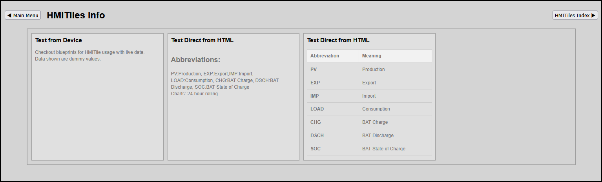

# INFO

**Data Type**: `info`

---

## Overview
This tile displays textual data from device or direct defined in HTML tag div.

**Preview**


**IMPORTANT**
Lookup `index.html` for latest examples.

## Configuration Parameters 
(HTML Data Attributes)

To build out dashboard data grid columns, configure the following core attributes on the `.hmi-pack-tile` chassis.

Two options to display textual data:
1. From the device Data property using attribute `data-device-idx` (e.g. data-device-idx="1").
The data could be taken from a Domoticz device type General, subtype Text.

2. Set the text with HTML tags direct after defining the class `hmi-info-text`.
No attribute `data-device-idx` required.
```
<div class="hmi-info-text">This is <B>information</B> about how to use <U>HMITiles</U>.</div>
```

| Attribute | Expected Value | Description |
|-----------|----------------|-------------|
|`data-type`|"info"|Tells the JavaScript loop to register this card into the server log stream synchronization pipeline.|
|`data-device-idx`|"NNN"|Domoticz device index (`idx`) (optional).|

---

## Production Template Implementations

## 1. Text from Domoticz Device.
The data taken from Domoticz device type General, subtype Text property Data.
```
<div class="hmi-pack-tile" 
	data-type="info"
	data-device-idx="1">
	<div class="hmi-tile-header"><div class="hmi-pack-label">Text from Device</div></div>
	<div class="hmi-value-grid"></div>
</div>
```

## 2. Descending Drainage (4-Tier Battery Bank Monitor)
No device used but text direct defined with css class hmi-info-text.
```
<div class="hmi-pack-tile" 
	data-type="info">
	<div class="hmi-tile-header"><div class="hmi-pack-label">Text Direct from HTML</div></div>
	<div class="hmi-info-text">
		<h2>Abbreviations:</h2>PV:Production, EXP:Export,IMP:Import, LOAD:Consumption, CHG:BAT Charge, DSCH:BAT Discharge, SOC:BAT State of Charge<br>
		Charts: 24-hour-rolling</div>
</div>
```


---
