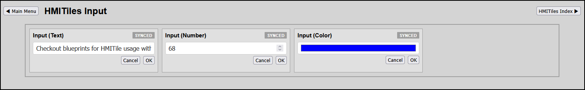

# INPUT

**Data Type**: `info`

---

## Overview
This tile enables to interactive enter data to update a Domoticz device property Data.
HTML Input Types supported:
* **Text**:		data-input-type="text"
* **Number**:	data-input-type="number"
* **Color**:	data-input-type="color"

Buttons: 
* **OK**: The input data is saved to the device property Data.
* **Cancel**: No action.

---

**Preview**


**IMPORTANT**
Lookup `index.html` for latest examples.

---

## Configuration Parameters 
(HTML Data Attributes)

To build out dashboard data grid columns, configure the following core attributes on the `.hmi-pack-tile` chassis.

| Attribute | Expected Value | Description |
|-----------|----------------|-------------|
|`data-device-idx`|"NNN"|Domoticz device index (`idx`) (mandatory).|
|`data-type`  |"input"         | HMI tile data type (mandatory) |
|`data-device-idx`|"NNN"       | Domoticz device index (property "idx") |
|`data-input-type`|"text string"     | HTML input type supported text, number, color|

---

## Input Types
To define more input types, amend the file hmitiles-processor.js.
See in code under `case "input"`.
If an input field gets its focus the mode changes to editing.

## Color Value
The color data is HEX value `#RRGGBB`. 
This is also required as the input value.
This means the device Data or any other property used, should contain the HEX string.
If the color field is clicked by the mousepointer the mode changes to editing.
After that the browser color dialog is shown as a popup.
Selecting a color in the color popup immediate changes the value of the input field, which immediate shows the selected color.

---

## Template Implementations

```
<!-- 
	INPUT
	Domoticz Type General / SubType Text
	Input text
-->
<div class="hmi-pack-tile" 
	data-type="input"
	data-device-idx="1"
	data-input-type="text"
	data-input-placeholder="Enter text...">
	<div class="hmi-tile-header">
		<div class="hmi-pack-label">Input (Text)</div>
		<div class="hmi-badge">SYNCED</div>
	</div>
	<div class="hmi-value-grid"></div>
</div>

<!-- 
	INPUT
	Domoticz Type General / SubType Text
	Input number
-->
<div class="hmi-pack-tile" 
	data-type="input"
	data-device-idx="13"
	data-input-type="number"
	data-input-placeholder="Enter number...">
	<div class="hmi-tile-header">
		<div class="hmi-pack-label">Input (Number)</div>
		<div class="hmi-badge">SYNCED</div>
	</div>
	<div class="hmi-value-grid"></div>
</div>

<!-- 
	INPUT
	Domoticz Type General / SubType Text
	Input color
-->
<div class="hmi-pack-tile" 
	data-type="input"
	data-device-idx="74"
	data-input-type="color"
	data-input-placeholder="Enter color...">
	<div class="hmi-tile-header">
		<div class="hmi-pack-label">Input (Color)</div>
		<div class="hmi-badge">SYNCED</div>
	</div>
	<div class="hmi-value-grid"></div>
</div>
```

---
