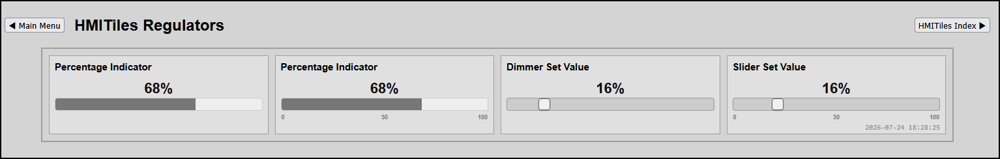

# REGULATORS

**Data Type**: `progressbar`, `dimmer`, `slider`

---

## Overview
The regulators are tiles to view or set a device value.
**Progressbar**
View the value of any device.

**Dimmer/Slider**
Set the value of a device from type Light/Switch, subtype Switch, switchtype Dimmer.

**Preview**

**IMPORTANT**
Lookup `index.html` for latest examples.

## Configuration Parameters 
(HTML Data Attributes)

To build out dashboard data grid columns, configure the following core attributes on the `.hmi-pack-tile` chassis.

| Attribute | Expected Value | Description |
|-----------|----------------|-------------|
|`data-type`|"progressbar","dimmer","slider"|Tells the JavaScript loop to register this card into the server log stream synchronization pipeline.|
|`data-device-idx`|"NNN"|Domoticz device index (`idx`) (mandatory).|
|`data-unit`  |"UNIT"          | Value unit displayed with the value above the bar. |
|`data-min`   |Any value, default "0" | Min value, left side of the bar. |
|`data-max`   |Any value, default "100" | Max value, right side of the bar. |
|`data-step`  |Any value, default "1" | Value step size when moving the bar. |
|`data-scale` |"1" or "0" | Show simple scale with min, mid and max value. |

**Preview**

**IMPORTANT**
Lookup `index.html` for latest documentation & examples.

---

## Production Template Implementations

### PROGRESSBAR 0-100%
Domoticz Type Any value
`´`

	

Percentage Indicator

	

`´`

### PROGRESSBAR SCALE
Domoticz Type Any value
`´`

	

Percentage Indicator

	

`´`

### DIMMER
Domoticz Type Light/Switch / SubType Switch / SwitchType Dimmer
`´`

	

Dimmer Set Value

	

`´`

### SLIDER
Domoticz Type Light/Switch / SubType Switch / SwitchType Dimmer
`´`

	

Slider Set Value

	

	

`´`

---
