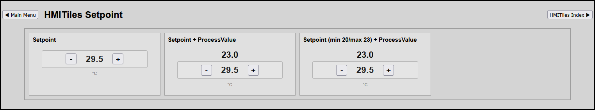

# SETPOINT

**Data Type**: `setpoint`, `setpointprocessvalue`.

---

## Overview
This tile builds an interactive dual-variable control tile that 
1. enables to set a Setpoint (SP) value or
2. pairs a Target Setpoint (SP) value with step-incrementers `[-]` / `[+]` directly alongside its real-time Actual Process Value (PV) sensor feedback channel inside a single modular tile.

Design:
* **Co-Located Visual Analytics**: Operators can instantly verify if a setpoint modification drives the physical hardware process state change effectively without switching between separate text logs or sensor grid dashboards.
* **Typographic Contrast Hierarchy**: The critical numerical metrics remain bold and high-contrast, while secondary static operational field markers use a muted charcoal layout presentation to minimize screen fatigue.

---

**Preview**


**IMPORTANT**
Lookup `index.html` for latest examples.

## Configuration Parameters 
(HTML Data Attributes)

To build out dashboard data grid columns, configure the following core attributes on the `.hmi-pack-tile` chassis.

| Attribute | Expected Value | Description |
|-----------|----------------|-------------|
|`data-type`|"setpoint","setpointprocessvalue"|Tells the JavaScript loop to register this card into the server log stream synchronization pipeline.|
|`data-device-idx`|"NNN"|Defines the primary Domoticz target element ID for the target Setpoint (SP) controller loop. (mandatory).|
|`data-device-idx-pv="NNN"`|Specifies the secondary Domoticz tracking element ID for the live Actual Process Value (PV) feedback channel.
|`data-step="N"`|Dictates the numerical step value shift increment (e.g., `1` or `0.5`).
|`data-min="NNN"`, `data-max="NNN"`|Optional attributes that enforce strict process boundary limits. Left unassigned, the system defaults to infinity constants (`Number.NEGATIVE_INFINITY` / `Number.POSITIVE_INFINITY`) to prevent accidental value clipping on high-capacity industrial devices.

### Component Control Actions
* **Plus/Minus Buttons (`.hmi-stepper-row button`)**: Increases or decreases the setpoint target. Triggers the `data-input-mode="editing"` guard instantly to isolate the visual field from periodic background overwrites while changes are in progress.
* **Value Text Display (`.hmi-value`)**: Stored as a pure, unformatted numeric string node. This ensures that sequential quick-clicks compute correctly without text suffix character parsing conflicts. 

---

## System Integration & API Tunneling

When an adjustment button is clicked, the boundary logic evaluates the new value against your constraints, updates the layout UI optimistically, and dispatches the payload to the native Domoticz setpoint target endpoint:

```http/json.htm?type=command&param=setsetpoint&idx={idx}&setpoint={nextSetpoint}
```

Once the network transaction returns a status of `"OK"`, the element-level lock clears to `readonly`, the tile header transitions cleanly back to `SYNCED`, and background server data synchronization resumes safely.

## Template Implementations

```
<!-- 
	SETPOINT
	Domoticz Type Setpoint / SubType Setpoint
	Generic single setpoint controller with layout
	[-][SP][+]
	Configurable Step Increment.
-->
<div class="hmi-pack-tile" 
	data-type="setpoint" 
	data-device-idx="10"
	data-step="0.5"
	data-unit="°C">
	<div class="hmi-tile-header"><div class="hmi-pack-label">Setpoint</div></div>
	<div class="hmi-value-grid"></div>
</div>

<!-- 
	SETPOINTPROCESSVALUE
	Domoticz Type Setpoint / SubType Setpoint
	Domoticz Type Temp / SubType LaCrosse TX3
	Combined stepper controller with layout
	   [PV]
	[-][SP][+]
-->
<div class="hmi-pack-tile" 
	data-type="setpointprocessvalue" 
	data-device-idx="10" 
	data-device-idx-pv="11"
	data-step="1"
	data-unit="°C">
	<div class="hmi-tile-header"><div class="hmi-pack-label">Setpoint + ProcessValue</div></div>
	<div class="hmi-value-grid"></div>
</div>

<!-- 
	SETPOINTPROCESSVALUE
	Domoticz Type Setpoint / SubType Setpoint
	Domoticz Type Temp / SubType LaCrosse TX3
	Combined stepper controller with layout
	   [PV]
	[-][SP][+]
-->
<div class="hmi-pack-tile" 
	data-type="setpointprocessvalue" 
	data-device-idx="10" 
	data-device-idx-pv="11"
	data-step="0.5"
	data-min="20"
	data-max="23"
	data-unit="°C">
	<div class="hmi-tile-header"><div class="hmi-pack-label">Setpoint (min 20/max 23) + ProcessValue</div></div>
	<div class="hmi-value-grid"></div>
</div>
```
