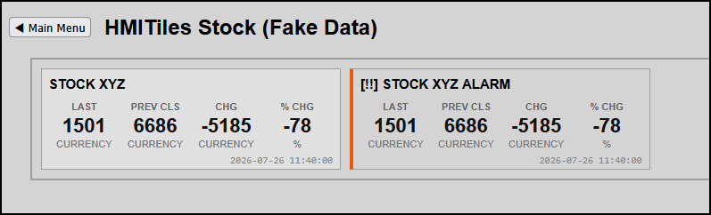

# STOCK

**Data Type**: `stock`

---

## Overview
The `stock` tile engine displays data based on the historical device day range:
The data is displayed in 4-columns:
* LAST: Value last read (current)
* PREV CLS: Value 24hr ago
* CHG: Value difference between LAST and PREV CLS
* CHG: As CHG but in percentage

**Note**
The origin intention of this tile, was to display stock data, but it can be used for any single device data.

**Preview**


**IMPORTANT**
Lookup `index.html` for latest examples.

---

## Configuration Parameters 
(HTML Data Attributes)

To build out dashboard data grid columns, configure the following core attributes on the `.hmi-pack-tile` chassis.

| Attribute | Expected Value | Description |
|-----------|----------------|-------------|
| `data-type` | `"stock"` | Explicitly targets the high-density grid row compilation matrix. |
| `data-device-idx` | `"IDX"` | Single Domoticz device idx to extract data from. |
| `data-labels` | `"0:LAST:CURRENCY;1:PREV CLS:CURRENCY;2:CHG:CURRENCY;3:% CHG:%"` | Semicolon-separated positional blueprint map linking headers and units to values. |

### Engineering Best Practices
* **Zero Label Overlap:** Keep descriptive labels (`LABEL`) compact (under 12 characters) to guarantee clean, unyielding layout margins without wrapping on standard responsive viewports.
* **Separation of Units:** Never inject static text units inside your Domoticz back-end strings. Let the backend preparser scrub numbers cleanly (`parseFloats`), and pass the visual context strings (`UNIT`) explicitly into the `data-labels` attribute profile.

---

### Stock Value
Display stock data.
```html
<div class="hmi-pack-tile hmi-clickable-tile" 
	data-type="stock" 
	data-device-idx="39"
	data-labels="0:LAST:CURRENCY;1:PREV CLS:CURRENCY;2:CHG:CURRENCY;3:CHG:%">
	<div class="hmi-tile-header"><div class="hmi-pack-label">STOCK XYZ</div></div>
	<div class="hmi-value-grid"></div>
	<div class="hmi-last-update" data-field="LastUpdate"></div>
</div>
```

### Stock Value Alarm
Display stock data with Alarm state using thresholds for the change value (CHG).
```html
<div class="hmi-pack-tile hmi-clickable-tile" 
	data-type="stock" 
	data-device-idx="39"
	data-labels="0:LAST:CURRENCY;1:PREV CLS:CURRENCY;2:CHG:CURRENCY;3:CHG:%"
	data-state-map="0:OK,10:FAIR,20:MODERATE,30:POOR,90:BAD"
	data-alarm-direction="up">
	<div class="hmi-tile-header"><div class="hmi-pack-label">STOCK XYZ ALARM</div></div>
	<div class="hmi-value-grid"></div>
	<div class="hmi-last-update" data-field="LastUpdate"></div>
</div>
```

