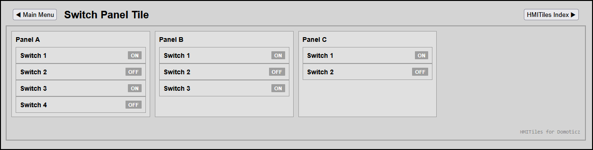

### Switch Panel Tile (Multi-Switch Blueprint)

The **Switch Panel Tile** is an advanced layout blueprint designed to aggregate multiple interactive switches within a single structural panel card. 
This avoids dashboard clutter and breaks the traditional "one device per tile" limitation of standard Domoticz widgets.



#### Key Features
* **Engine Native Integration**: Works perfectly alongside a tiny, backward-compatible adjustment to your `hmitiles.js` engine selector string.
* **Nesting-Safe Hierarchy**: By switching the nested elements to use the `.hmi-pack-innercard` class, the dashboard architecture clearly isolates standalone items from macro panel containers.

---

#### HTML Blueprint (Stacked Rows Layout)

See switchpaneltile/index.html.

---

Example:
```html
<!-- 2-SWITCH COMPACT PANEL BLOCK -->
<div class="hmi-pack-card">

	<div class="hmi-card-header">
		<div class="hmi-pack-label">4-Switch Panel</div>
	</div>

	<div class="hmi-value-grid">
		<!-- SWITCH 1 (IDX 1) -->
		<div class="hmi-pack-innercard" data-type="switch" data-device-idx="1" style="margin: 0; min-height: auto;">
			<div class="hmi-card-header">
				<div class="hmi-pack-label">Switch 1</div>
				<div class="hmi-badge hmi-clickable-badge">OFF</div>
			</div>
		</div>
		<!-- SWITCH 2 (IDX 6) -->
		<div class="hmi-pack-innercard" data-type="switch" data-device-idx="6" style="margin: 0; min-height: auto;">
			<div class="hmi-card-header">
				<div class="hmi-pack-label">Switch 2</div>
				<div class="hmi-badge hmi-clickable-badge">OFF</div>
			</div>
		</div>
	</div>
</div>
```
