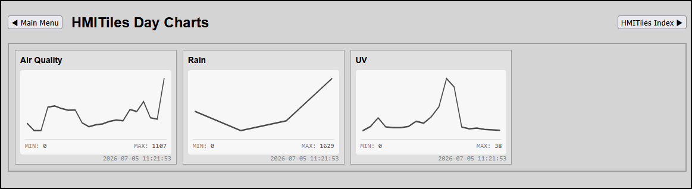

# Trends

## Historical Trend & Rolling Chart Components (`data-type="trend" | "chart"`)

Trend components display historical datasets as high-density, full-width single-line SVG sparkline vector graphs. These elements bypass multi-column splitting and read telemetry logs directly to calculate internal coordinates. The engine automatically maps the dataset's absolute mathematical parameters, rendering baseline indicators and timeline stats cleanly with zero data distortion.

**Preview**


### Trend Configuration Markups##### 1. Pure Automated Autoscale Trend Card*Executes an isolated 24-hour log query against the specified index. Automatically tracks variations, pins maximums/minimums, and charts real-time data parameters dynamically.*```html
```
<div class="hmi-pack-tile" data-device-idx="39" data-type="trend">
    <div class="hmi-tile-header"><div class="hmi-pack-label">Solar Production</div></div>
    <div class="hmi-value-grid"></div>
    <div class="hmi-last-value"></div>
    <div class="hmi-last-update"></div>
</div>
```

### 2. Static Baseline Utility Tracker (e.g., Battery SoC)*Handles constant or flat-line parameters natively without layout shifts or division-by-zero crashes. If data points are identical (e.g., constant 100%), the vector line anchors perfectly along the lower floor plane to accurately preserve low visual noise contracts.*```html
```
<div class="hmi-pack-tile" data-type="trend" data-device-idx="4">
    <div class="hmi-tile-header"><div class="hmi-pack-label">Battery Level Bank</div></div>
    <div class="hmi-value-grid"></div>
    <div class="hmi-last-value"></div>
    <div class="hmi-last-update"></div>
</div>
```
---

### Architectural Layout & Spacing Laws* **Global Box-Model Breathing Room**: To prevent absolute-positioned baseline footers (`.hmi-last-value` and `.hmi-last-update`) from crashing or overlapping with the `.hmi-trend-stats` text layer, the master card container applies an expanded bottom padding model natively inside your stylesheet:```css
```
.hmi-pack-tile {
    box-sizing: border-box !important;
    padding: 8px 8px 30px 8px !important; /* Forces 30px of inward bottom space */
}
```* **Dark Theme Pointer-Event Immunity**: To secure total visual and structural rendering stability inside your experimental dark theme dashboard views, trend tiles utilize an explicit layout interaction shield:```css
.theme-dark .hmi-pack-tile[data-type="trend"]:hover,
.theme-dark .hmi-pack-tile[data-type="chart"]:hover {
    pointer-events: none !important;
}
```

* This blocks the browser from executing hover recalculations when the mouse cursor glides across graphs, locking your custom trend line colors and theme backgrounds completely in place without flickering.
The data tokens and specifications are target-locked and cleanly grouped.

