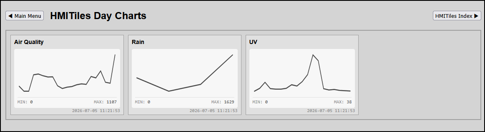

# TRENDS

**Data Type**: `trend`

---

## Overview
Historical Trend & Rolling Chart Components.

Trend components display historical datasets as high-density, full-width single-line SVG sparkline vector graphs. These elements bypass multi-column splitting and read telemetry logs directly to calculate internal coordinates. The engine automatically maps the dataset's absolute mathematical parameters, rendering baseline indicators and timeline stats cleanly with zero data distortion.

**Preview**


**IMPORTANT**
Lookup `index.html` for latest examples.

## Configuration Parameters 
(HTML Data Attributes)

To build out dashboard data grid columns, configure the following core attributes on the `.hmi-pack-tile` chassis.

| Attribute | Expected Value | Description |
|-----------|----------------|-------------|
|`data-type`|"trend"|Tells the JavaScript loop to register this tile into the server log stream synchronization pipeline.|
|`data-device-idx`|"NNN"|Domoticz device index (`idx`) (mandatory).|
|`data-unit`  |"UNIT"          | Value unit displayed with the value above the bar. |

### Template Implementations
Executes an isolated 24-hour log query against the specified index. 
Automatically tracks variations, pins maximums/minimums, and charts real-time data parameters dynamically.
```html
<div class="hmi-pack-tile" 
	data-type="trend" 
	data-device-idx="3" 
	data-unit="ppm">
	<div class="hmi-tile-header">
		<div class="hmi-pack-label">Air Quality</div>
	</div>
	<!-- LEAVE BLANK: Automatically filled with dynamic SVG canvas -->
	<div class="hmi-value-grid"></div>
	<div class="hmi-last-value"></div>
	<div class="hmi-last-update"></div>
</div>
```

---

### Architectural Layout & Spacing Laws

#### Global Box-Model Breathing Room
To prevent absolute-positioned baseline footers (`.hmi-last-value` and `.hmi-last-update`) from crashing or overlapping with the `.hmi-trend-stats` text layer, 
the master card container applies an expanded bottom padding model natively inside your stylesheet:
```css
.hmi-pack-tile {
    box-sizing: border-box !important;
    padding: 8px 8px 30px 8px !important; /* Forces 30px of inward bottom space */
}
```

#### Dark Theme Pointer-Event Immunity
To secure total visual and structural rendering stability inside your experimental dark theme dashboard views, trend tiles utilize an explicit layout interaction shield:```css
.theme-dark .hmi-pack-tile[data-type="trend"]:hover,
.theme-dark .hmi-pack-tile[data-type="chart"]:hover {
    pointer-events: none !important;
}
```
This blocks the browser from executing hover recalculations when the mouse cursor glides across graphs, locking your custom trend line colors and theme backgrounds completely in place without flickering.
The data tokens and specifications are target-locked and cleanly grouped.

