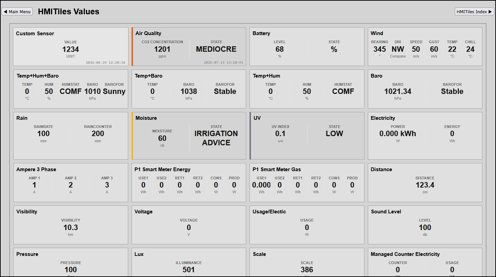

# Values

------------------------------
## High-Density Value Component Blueprints (data-type="value")
Value tiles display live telemetry inside a structured grid canvas. The data-labels attribute is strictly mandatory and serves as the absolute master authority for column rendering. The layout engine splits your pre-parsed data rows automatically based on specified segment indexes, eliminating layout guessing.

**Preview**



## Core Implementation Markups## 1. Standard Single-Value Sensor (e.g., Distance)
Uses the pre-parser parseSingleValue() helper to isolate numbers from text trailing spaces seamlessly.

```
<div class="hmi-pack-tile hmi-clickable-tile" 
     data-device-idx="52" data-type="value"
     data-labels="0:Distance:cm">
    <div class="hmi-tile-header"><div class="hmi-pack-label">Custom Distance</div></div>
    <div class="hmi-value-grid"></div>
    <div class="hmi-last-update"></div>
</div>
```

## 2. Multi-Phase Electrical Amperage (3-Column Grid Layout)
Maps multi-value current strings (e.g., "1.0 A, 2.0 A, 3.0 A" normalized into "1.0;2.0;3.0") across distinct horizontal columns.

```
<div class="hmi-pack-tile hmi-clickable-tile" 
     data-device-idx="14" data-type="value"
     data-labels="0:Phase 1:A;1:Phase 2:A;2:Phase 3:A">
    <div class="hmi-tile-header"><div class="hmi-pack-label">Current Grid Loads</div></div>
    <div class="hmi-value-grid"></div>
    <div class="hmi-last-update"></div>
</div>
```

## 3. Meteorological Precipitation Tracker (2-Column Array Layout)
Picks apart structured dual-value payloads (e.g., Rain Rate and Daily Accumulation formatted as "100;200").

```
<div class="hmi-pack-tile hmi-clickable-tile" 
     data-device-idx="72" data-type="value"
     data-labels="0:Rain Rate:mm/h;1:Total Accum:mm">
    <div class="hmi-tile-header"><div class="hmi-pack-label">Precipitation Tracker</div></div>
    <div class="hmi-value-grid"></div>
    <div class="hmi-last-update"></div>
</div>
```

## 4. Climate Environment Suite (3-Column Combo Layout)
Maps native composite sensor payloads (e.g., "21.2;50;COMF") instantly under clear column headers.

```
<div class="hmi-pack-tile hmi-clickable-tile" 
     data-device-idx="8" data-type="value"
     data-labels="0:Temp:°C;1:Humidity:%;2:Comfort:">
    <div class="hmi-tile-header"><div class="hmi-pack-label">Living Room Climate</div></div>
    <div class="hmi-value-grid"></div>
    <div class="hmi-last-update"></div>
</div>
```

------------------------------
## Symmetrical Grid Alignment Laws

* data-labels="[INDEX]:[TITLE]:[UNIT];...": Each section separated by a semicolon represents a unique vertical data pillar. You can slice up to 7 layout columns horizontally.
* Proportional Width Isolation: Individual data cells apply flex-basis: 100% !important inside your stylesheet. This locks all grid columns into perfectly symmetrical widths, preventing empty layout units from causing visual column collisions or clipping.

------------------------------

