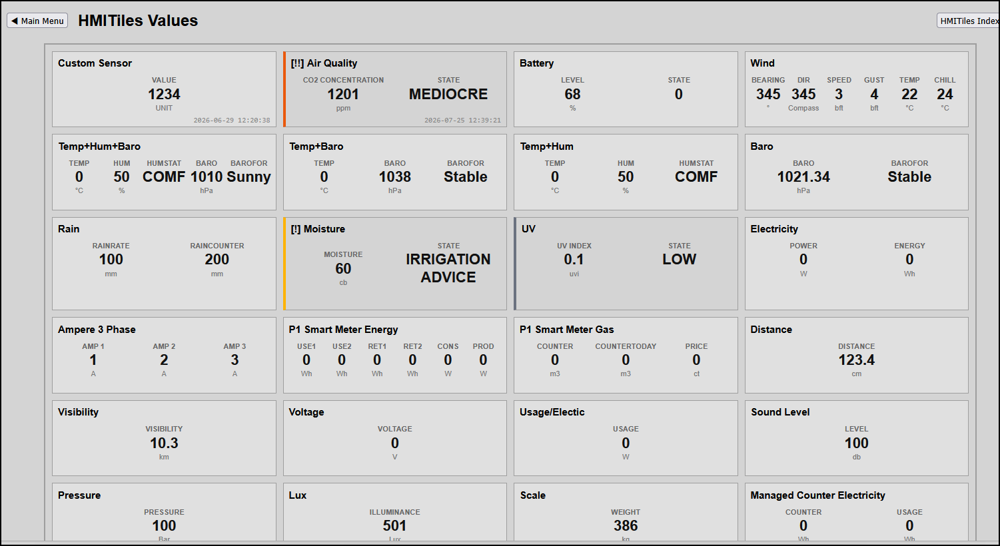
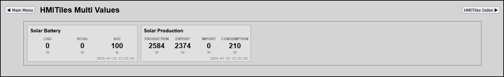

# VALUE

**Data Type**: `value`

---

## Overview
The `value` tile engine dynamically scales to support high-density metric rows, ranging from a single value up to 7 horizontal layout columns. 
The layout engine automatically balances space boundaries and grid structures based on the configuration of your HTML markup tags.

This unified approach allows you to seamlessly map a single hardware sensor, a multi-value dataset from a single Domoticz hardware device (e.g., kWh counters tracking Today/Usage), or combine telemetry from up to 7 entirely independent Domoticz hardware devices simultaneously.

**Preview**


**Values Multiple Devices**


**IMPORTANT**
Lookup `index.html` for latest examples.

---

## Configuration Parameters 
(HTML Data Attributes)

To build out dashboard data grid columns, configure the following core attributes on the `.hmi-pack-tile` chassis.

| Attribute | Expected Value | Description |
|-----------|----------------|-------------|
| `data-type` | `"value"` | Explicitly targets the high-density grid row compilation matrix. |
| `data-device-idx` | `"IDX"` or `"IDX1;IDX2;IDX3"` | Semicolon-separated string of the Domoticz hardware tracker indices to extract. |
| `data-labels` | `"INDEX:LABEL:UNIT;INDEX:LABEL:UNIT"` | Semicolon-separated positional blueprint map linking headers and units to values. |

### Engineering Best Practices
* **Zero Label Overlap:** Keep descriptive labels (`LABEL`) compact (under 12 characters) to guarantee clean, unyielding layout margins without wrapping on standard responsive viewports.
* **Separation of Units:** Never inject static text units inside your Domoticz back-end strings. Let the backend preparser scrub numbers cleanly (`parseFloats`), and pass the visual context strings (`UNIT`) explicitly into the `data-labels` attribute profile.

---

### Single Value Target Mode
Extracts a standalone telemetry metric out of a standard device payload.

```html
<div class="hmi-pack-tile" 
     data-type="value" 
     data-device-idx="12" 
     data-labels="0:VOC:ppm">
     <div class="hmi-tile-header"><div class="hmi-pack-label">Air Quality</div></div>
     <div class="hmi-value-grid"></div>
     <div class="hmi-last-update"></div>
</div>
```

#### Multi-Value Target Mode (Single Hardware Device)
Extracts multi-segmented CSV telemetry payloads generated from a single specialized device configuration block (such as a smart meter device returning separate data pools).

```html
<div class="hmi-pack-tile" 
     data-type="value" 
     data-device-idx="14" 
     data-labels="0:TODAY:kWh;1:USAGE:W">
     <div class="hmi-tile-header"><div class="hmi-pack-label">Smart Meter</div></div>
     <div class="hmi-value-grid"></div>
     <div class="hmi-last-update"></div>
</div>
```

#### Multi-Device Target Matrix (Up to 7 Devices Combined)
Gathers single live data values from multiple, entirely distinct hardware index references in your Domoticz system, compiling them dynamically into a unified virtual row layout.

```html
<div class="hmi-pack-tile" 
     data-type="value" 
     data-device-idx="43;44;45" 
     data-labels="0:CHG:W;1:DCHG:W;2:SOC:%">
     <div class="hmi-tile-header"><div class="hmi-pack-label">Solar Battery</div></div>
     <div class="hmi-value-grid"></div>
     <div class="hmi-last-update"></div>
</div>
```

---

## Hints
**Multiple Values**
- To see the log of the first device, set div class="hmi-pack-tile hmi-clickable-tile".
- Max 7 devices are supported, e.g. `data-device-idx="1;2;3;4;5;6;7"`. The limit is caused by the width of a tile (as defined in `hmitiles.js`).
