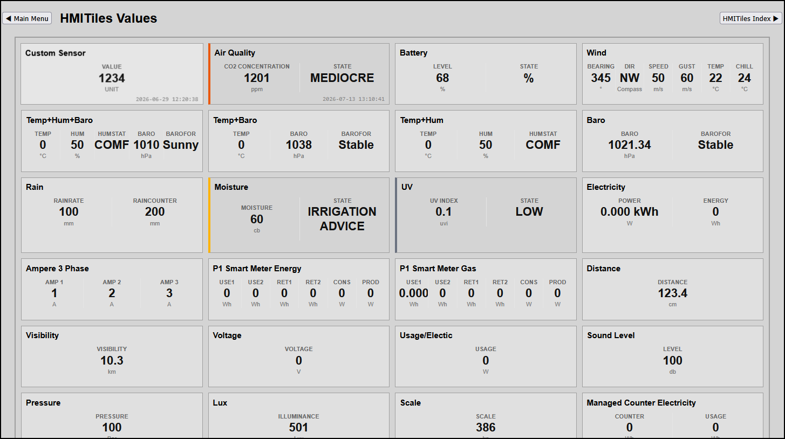

# VALUE

**Data Type**: `value`

---

## Overview
The `value` tile engine dynamically scales to support high-density metric rows, ranging from a single value up to 7 horizontal layout columns. 
The layout engine automatically balances space boundaries and grid structures based on the configuration of your HTML markup tags.

This unified approach allows you to seamlessly map a single hardware sensor, a multi-value dataset from a single Domoticz hardware device (e.g., kWh counters tracking Today/Usage), or combine telemetry from up to 7 entirely independent Domoticz hardware devices simultaneously.

**Preview**


**Values Multiple Devices**


**IMPORTANT**
Lookup `index.html` for latest examples.

## More Documentation
For more information, see README.md in folder `blueprints/values`.

---

## Template Implementations

Gathers single live data values from multiple, entirely distinct hardware index references in your Domoticz system, compiling them dynamically into a unified virtual row layout.

```html
<div class="hmi-pack-tile" 
     data-type="value" 
     data-device-idx="43;44;45" 
     data-labels="0:CHG:W;1:DCHG:W;2:SOC:%">
     <div class="hmi-tile-header"><div class="hmi-pack-label">Solar Battery</div></div>
     <div class="hmi-value-grid"></div>
     <div class="hmi-last-update"></div>
</div>
```

---

