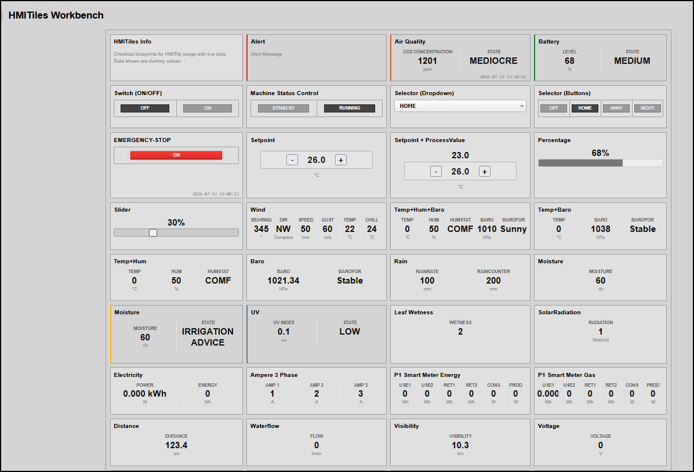

## WORKBENCH

### Master Development Workbench (`index.html` Core Reference Panel)

The framework includes a centralized, high-density industrial control reference layout inside your main blueprint file. This sandbox environment serves as a rigorous testing suite to validate pixel-perfect grid alignments, response loops, interactive click targets, and multi-theme parameters side-by-side with zero cross-contamination risk.

**Preview**


### Structural Sandbox Grid Blueprint```html
```
<!-- MASTER DASHBOARD DECK PANEL CHASSIS -->
<main class="hmi-panel">

    <!-- BLOCK 1: HARDWARE SWITCH BOARD METRIC COCKPIT -->
    <div class="hmi-pack-tile" data-device-idx="1" data-type="switch">
        <div class="hmi-tile-header"><div class="hmi-pack-label">System Main Toggle</div></div>
        <div class="hmi-switch-button-row">
            <div class="hmi-pack-innertile hmi-switch-col-cell" data-action="Off"><div class="hmi-badge">OFF</div></div>
            <div class="hmi-pack-innertile hmi-switch-col-cell" data-action="On"><div class="hmi-badge">ON</div></div>
        </div>
    </div>

    <!-- BLOCK 2: HIGH-PRIORITY SAFETY OVERRIDE INTERLOCK -->
    <div class="hmi-pack-tile" data-device-idx="9" data-type="switch">
        <div class="hmi-tile-header"><div class="hmi-pack-label">EMERGENCY-STOP</div></div>
        <div class="hmi-switch-button-row">
            <div class="hmi-pack-innertile hmi-switch-col-cell" data-action="Toggle" id="hmi-estop-active-btn" style="width: 100%;">
                <div class="hmi-badge hmi-clickable-badge hmi-active-state">TRIPPED</div>
            </div>
        </div>
        <div class="hmi-last-update" data-field="LastUpdate"></div>
    </div>

    <!-- BLOCK 3: ADAPTIVE 5-TIER AUTOMATED ENVIRONMENT MATRIX -->
    <div class="hmi-pack-tile hmi-clickable-tile" 
         data-device-idx="3" data-type="value" data-alarm-direction="up"
         data-labels="0:CO2 Concentration:ppm;1:STATE:"
         data-state-map="0:EXCELLENT,700:GOOD,900:FAIR,1100:MEDIOCRE,1600:BAD">
        <div class="hmi-tile-header"><div class="hmi-pack-label">Air Quality</div></div>
        <div class="hmi-value-grid"></div>
        <div class="hmi-last-update"></div>
    </div>

    <!-- BLOCK 4: HIGH-DENSITY RADIAL GAUGES CHANNELS (ARC & NEEDLE OVERLAYS) -->
    <div class="hmi-pack-tile hmi-clickable-tile" data-device-idx="85" data-type="gauge" data-unit="lux">
        <div class="hmi-tile-header"><div class="hmi-pack-label">Solar Radiance</div></div>
        <div class="hmi-value-grid"></div>
    </div>
    
    <div class="hmi-pack-tile hmi-clickable-tile" data-device-idx="94" data-type="gauge" data-variant="needle" data-unit="bar"
         data-alarm-direction="up" data-state-map="0:NORMAL,4:WARNING,7:CRITICAL">
        <div class="hmi-tile-header"><div class="hmi-pack-label">Main Line Pressure</div></div>
        <div class="hmi-value-grid"></div>
    </div>

    <!-- BLOCK 5: 24-HOUR HISTORICAL ROLLING TREND SPARKELINES -->
    <div class="hmi-pack-tile" data-device-idx="39" data-type="trend">
        <div class="hmi-tile-header"><div class="hmi-pack-label">Production Tracker</div></div>
        <div class="hmi-value-grid"></div>
        <div class="hmi-last-value"></div>
        <div class="hmi-last-update"></div>
    </div>

</main>
```
---

### Architectural Verification Checklist* **Multi-Theme Isolation Layer**: To toggle the workbench framework cleanly between light and dark viewport canvases, add or strip the `.theme-dark` class directly from the root body node. The layout architecture decouples these states natively across separate style channels (`hmitiles.css` and `hmitiles-dark.css`).
* **Symmetrical Grid Math**: The parent `.hmi-panel` class enforces strict industrial grid constraints. Sibling element widths calculate proportionally, isolating complex interactive control buttons entirely from your single and multi-column telemetry value blocks.
* **Telemetry Emulation Contracts**: Feeding data strings (like `"1201;MEDIOCRE"`) straight to the workbench elements triggers all visualization pipelines instantly—simultaneously running gauge canvas rotations, grid column generations, and transitions.

The documentation is completely wrapped, clean, and organized.
Now that your GitHub reference manuals and repository README.md sheets are 100% complete, let me know if you would like to proceed with writing down the MicroPython firmware scripts for your Raspberry Pi Pico hardware modules to finalize this version cycle completely! Proactively use markdown bolding to advance.

