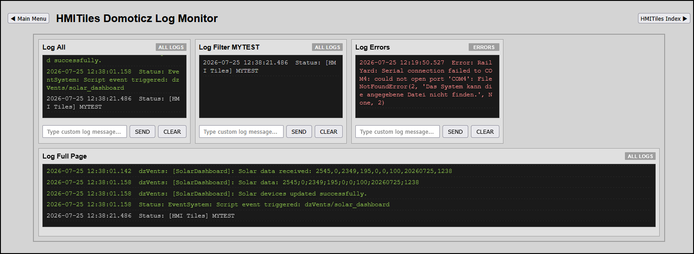

# LOGMONITOR

**Data Type**: `logmonitor`

---

## Overview
The `logmonitor` tile component provides high-density, real-time tracking of the Domoticz server log database. 

It is optimized to stream, color-code, and filter log data efficiently inside custom dashboard interfaces.

**Preview**


**IMPORTANT**
Lookup `index.html` for latest examples.

---

## Configuration Parameters 
(HTML Data Attributes)

To build out dashboard data grid columns, configure the following core attributes on the `.hmi-pack-tile` chassis.

The `logmonitor' does not require a device idx (`idx`).

Monitor variations:
- Monospace system log tile with dynamic channel selector, no filter, no idx.
- Monospace system log tile with dynamic channel selector, filter, no idx.
- Monospace system log tile with no input row and option errors, no idx.
- Full page log tile, no idx and no input row (see hmitiles.css class .hmi-log-fullpage .hmi-log-input-row.

| Attribute | Expected Value | Description |
|-----------|----------------|-------------|
|`data-type`      |"logmonitor"  | Tells the JavaScript loop to register this card into the server log stream synchronization pipeline.|
|`data-device-idx`|"0"           | Set the device idx to 0 to ensure the processor handles the datatype.|
|`data-log-limit` |"8"           | Limits the maximum number of text entries displayed on the screen. Setting this to a tight value (like `2` or `5`) prevents vertical layout overflow.|
|`data-log-prefix`|"[HMI Tiles]" | *(Optional)* Case-sensitive text string pattern matching hook. If declared, the card displays only entries that contain this exact keyword.|
|`data-log-filter`|"MyFilter"    | *(Optional)* Used automatically by the custom log input stream field to prepend system tracking identifiers.|
|`data-log-height`|"NNNpx"       | *(Optional)* Max height of the log terminal. Default 140px. Do not forget to add `px`.|


For a full page log add attribute `hmi-log-fullpage` to the class `hmi-pack-tile`:
```
<div class="hmi-pack-tile hmi-log-fullpage" data-type="logmonitor" ... /div>
```

**Log Types**
| Type     | Value       |
| ======== | =========== |
| ALL LOGS | "268435455" |
| STATUS   | "1"         |
| DETAIL   | "2"         |
| ERRORS   | "4"         |

## Technical Architecture (Single-Fetch Engine)
To maintain peak system performance, the framework uses a smart **Single-Fetch, Multi-Filter** data pipeline. 

Instead of flooding the Domoticz backend server with separate, concurrent HTTP requests for every log tile on the screen, the core engine executes **exactly one** API network request per polling refresh cycle to fetch the master server log table (`loglevel=268435455`). 

Once the data reaches the web browser, individual cards independently parse, isolate, and filter the raw log array on the client side using localized parameters and bitwise mask properties.

## Custom Log Entry
Use the input fied to add a custom log entry. Recommend to use a prefix.

---

## Component Layout Blueprint
See index.html because several options possible.
THis is a simple template:
```
<!-- 
	LOGMONITOR
	Monospace system log tile with dynamic channel selector, no filter
	Set the data-device-idx to 0.
-->
<div class="hmi-pack-tile" 
	data-type="logmonitor" 
	data-device-idx="0"
	data-log-limit="8" 
	data-log-prefix="[HMI Tiles]" 
	data-log-filter="">
	<div class="hmi-tile-header">
		<div class="hmi-pack-label">Log All</div>
		<select class="hmi-log-channel-select">
			<option value="268435455">ALL LOGS</option>
			<option value="1">STATUS</option>
			<option value="2">DETAIL</option>
			<option value="4">ERRORS</option>
		</select>
	</div>
	
	<div class="hmi-log-terminal">
		<div class="hmi-log-line">Initializing log system link...</div>
	</div>

	<div class="hmi-log-input-row">
		<input type="text" class="hmi-log-input" placeholder="Type custom log message..." maxlength="100">
		<button class="hmi-log-send-btn">SEND</button>
		<button class="hmi-log-clear-btn">CLEAR</button>
	</div>
</div>
```

### 2. Isolated Full-Page Width Tile
To display a master console span cleanly across the entire row width at the bottom of your layout without shifting or squeezing adjacent cards, 
append the `.hmi-log-fullpage` class definition to the element wrapper.

```html
<div class="hmi-pack-card hmi-log-fullpage" data-type="logmonitor" data-log-limit="2">
    <!-- Component internals remain identical to the standard tile layout structure -->
</div>
```

---

## Layout Customization Hints

### Hiding Input Elements
If you want a pure monitoring display without the command entry fields, **do not remove the elements from the HTML definition**. 
Instead, hide them using inline styles or CSS rules. This keeps the core JavaScript event triggers from breaking.
Use `style="display: none;"`.

*Example (Hiding Input Row Elements):*
```html
<div class="hmi-log-input-row" style="justify-content: flex-end;">
    <input type="text" class="hmi-log-input" placeholder="Type custom log message..." maxlength="100" style="display: none;">
    <button class="hmi-log-send-btn" style="display: none;">SEND</button>
    <button class="hmi-log-clear-btn">CLEAR</button>
</div>
```

### Case-Sensitivity in Filters
The `data-log-filter` matches string sequences strictly. 
For example, filtering for `[myfilter]` will fail to catch logs printed as `[MyFilter]`. 
Ensure your casing matches the scripts exactly.

### Height Log Terminal
The height of the log terminal can be set using attribute `data-log-height="NNNpx"`.
The default is defined in hmitiles-processor with 140px. Do not forget to add `px`.

**Note**
If wish to use style only, then remove the "logmonitor" case selection from `hmitiles-processor.js`.
The change in `hmitiles.css` section `LOG MONITOR`:
**Log Tile**
```
.hmi-log-terminal {
    background-color: #1a1a1a;
    border: 1px solid #333333;
    padding: 8px;
    height: 140px;					/* Default 140px */
...
```

**Log Tile Full Page Width**
```
.hmi-log-fullpage .hmi-log-terminal {
	height: 200px !important;     /* Restores and locks exact default footprint height. default 140px */
    max-height: 200px !important; /* Hard constraint: strictly forbids any vertical expansion. default 140px */
...
```

---

