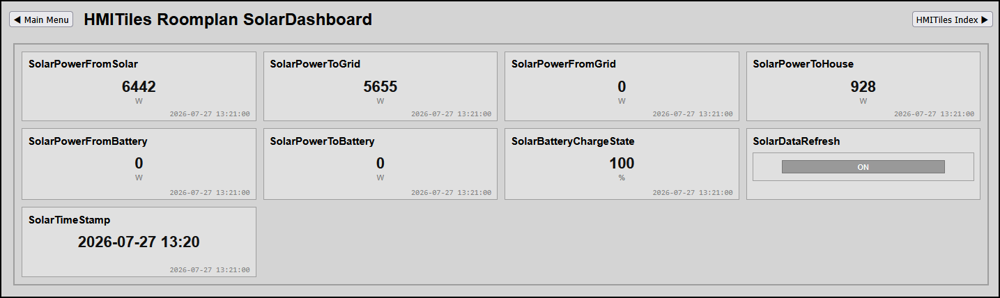

# ROOMPLAN

**Data-Class**: roomplan

---

## Overview
This extension automates your layout creation by dynamically building custom web dashboard panels directly from the device layouts you have already configured within a Domoticz `Roomplan`.

**Preview**


> [!NOTE]
> **IMPORTANT:** Check `indexNN.html` for the latest implementation examples.

---

## Configuration Parameters
To automatically build out your dashboard grid, simply configure the following core attributes directly on your main panel's `<main class="hmi-panel">` tag.

| Attribute | Expected Value | Description |
| :--- | :--- | :--- |
| `data-class` | `"roomplan"` | Tells the JavaScript engine to dynamically generate tiles using a Domoticz roomplan template. |
| `data-class-idx`| `"NNN"` | Your specific Domoticz Roomplan ID index. You can find this index number (idx) inside the Domoticz UI under Setup -> Plans. |

---

## How It Works
Instead of manually writing HTML layout blocks for every individual smart home device, this plugin processes your devices automatically at boot time:

1. **DOM Evaluation:** The script checks your `index.html` for a container tag using `data-class="roomplan"` and extracts its Roomplan ID (`data-class-idx="ROOMPLANIDX"`).
2. **Room Layout Fetch:** It runs a quick background network request to find all device IDs assigned to that roomplan:  
   `http://IP:PORT/json.htm?type=command&param=getplandevices&idx=ROOMPLANIDX`
3. **Hardware Profile Scan:** It retrieves the detailed signatures for those devices from your system:  
   `http://IP:PORT/json.htm?type=command&param=getdevices&filter=all`
4. **Layout Mapping:** It automatically pairs each device's **Type**, **SubType**, and **SwitchType** against the custom layout templates stored inside your external configuration map file: `/templates/hmitiles/core/hmitiles-roomplan.json`.
5. **Dashboard Generation:** It replaces your loading screen with live, interactive tiles (value readouts, toggle switches, setpoint adjusters), and passes them straight to the core engine to start real-time data polling.

---

## Panel File Setup (`index.html`)
To deploy a dynamic room dashboard screen, format your dashboard file using this clean HTML template layout block. Replace `ROOMPLANIDX` with your actual Domoticz room plan ID number.

```html
<!DOCTYPE html>
<html lang="en">
<head>
    <meta charset="UTF-8">
    <meta name="viewport" content="width=device-width, initial-scale=1.0">
    <title>HMITiles Roomplan</title>
    <link rel="stylesheet" href="/templates/hmitiles/core/hmitiles.css">
    
    <!-- Core layout processing module -->
    <script type="module" src="/templates/hmitiles/core/hmitiles.js"></script>
</head>
<body>

    <!-- The dashboard layout generator populates everything inside this tag -->
    <main class="hmi-panel" data-class="roomplan" data-class-idx="ROOMPLANIDX">
        <div class="hmi-loading">Querying Domoticz room plan assets...</div>
    </main>

</body>
</html>
```

---

## How to Enhance & Add Device Layouts (For Developers)
Adding support for new smart home hardware requires **zero changes to the JavaScript core dashboard code**. All device designs are defined cleanly using simple configurations inside `/templates/hmitiles/core/hmitiles-roomplan.json`. 

You can use the existing layout file as a reference, as many common Domoticz device profiles are already pre-configured.

### Device Configuration Structure
Each hardware profile is declared as a simple JSON object containing these keys:

| Key | Value Type | Example | Description |
| :--- | :--- | :--- | :--- |
| `"type"` | `String` | `"type": "Light/Switch"` | Domoticz hardware type signature *(Mandatory)*. |
| `"subtype"` | `String` | `"subtype": "Switch"` | Domoticz subtype classification. |
| `"switchtype"`| `String` | `"switchtype": "On/Off"`| Domoticz specific switch mode string. |
| `"columns"` | `String` | `"columns": "0:Temp:°C"` | Sets up the layout labels using the format: `INDEX:TITLE:UNIT`. Separate multiple columns with a semicolon. |
| `"html"` | `String` | See below. | The actual web layout structure for the tile. |

> [!TIP]
> **Formatting Note:** Since the full layout template sits inside a JSON string value, all literal double quotes (`"`) inside your HTML code must be escaped as `\"`.

### Writing Tile HTML Layouts
Your custom tile configurations should follow a clear 4-part layout structure:

#### 1. Main Wrapper Class
Define your target data layout properties and include your dynamic replacement placeholders:
```html
<div class=\"hmi-pack-tile hmi-clickable-tile\" data-type=\"value\" data-device-idx=\"{{idx}}\" data-labels=\"{{labels}}\">
```

#### 2. Header Title Label
Displays the name you assigned to your device inside Domoticz using the `{{name}}` template tag:
```html
<div class=\"hmi-tile-header\">
    <div class=\"hmi-pack-label\">{{name}}</div>
</div>
```

#### 4. Real-Time Data Grids
Provides the clean grid spacing container where your live sensor data renders automatically. No manual changes are needed inside this element:
```html
<div class=\"hmi-value-grid\"></div>
```

#### 4. Last Updated Timestamp (Optional)
To display the exact time your smart appliance last checked in or updated its state, include this utility element at the bottom of your tile:
```html
<div class=\"hmi-last-update\"></div>
```

### Full JSON Layout Examples
Here are two real-world configuration examples showing how different hardware profiles translate to clean, responsive web dashboard tiles:

```json
{
  "type": "Temp",
  "subtype": "",
  "switchtype": "",
  "columns": "0:Temp:°C",
  "html": "<div class=\"hmi-pack-tile hmi-clickable-tile\" data-type=\"value\" data-device-idx=\"{{idx}}\" data-labels=\"{{labels}}\"><div class=\"hmi-tile-header\"><div class=\"hmi-pack-label\">{{name}}</div></div><div class=\"hmi-value-grid\"></div><div class=\"hmi-last-update\"></div></div>"
}
```

```json
{
  "type": "Light/Switch",
  "subtype": "Switch",
  "switchtype": "On/Off",
  "columns": "",
  "html": "<div class=\"hmi-pack-tile\"><div class=\"hmi-tile-header\"><div class=\"hmi-pack-label\">{{name}}</div></div><div class=\"hmi-switch-button-row\"><div class=\"hmi-pack-innertile hmi-switch-col-cell\" data-type=\"switch\" data-device-idx=\"{{idx}}\" data-action=\"Toggle\" data-on-text=\"ON\" data-off-text=\"OFF\"><div class=\"hmi-badge hmi-clickable-badge\"></div></div></div></div>"
}
```
